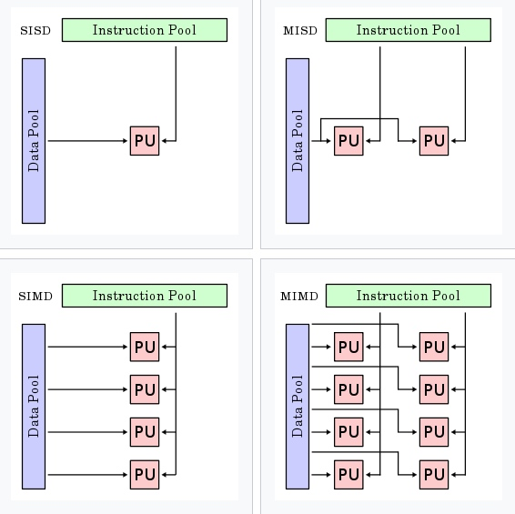

<!-- migrated-from: https://tangwz.com/posts/202008-intro-distributed-system/ -->

Google “三驾马车”论文发布以后，“大数据”和“分布式”就成了各种科技新闻媒体的“宠儿”，虽然如今头版已被“人工智能”、“机器学习”占据，围绕着解决大规模分布式应用技术挑战的话题还是能引起广泛的关注。

回想当初还在大学时候，我喜欢分布式而不是机器学习，主要是因为相比于机器学习大块大块的公式，分布式系统几乎不需要太多数学知识，它是一门理论模型与工程技法并重的学科。作为一个分布式系列的开篇，本文没有高深的论文和复杂的数学，只是分享我对分布式系统的一些认识。

# 费林分类法（Flynn’s Taxonomy）

费林根据资讯流（information stream）可分成指令（Instruction）和资料（Data）两种，把计算模型分为4类：

*   单指令流单数据流计算机（SISD）：传统的单核 CPU，没有并行计算。
*   单指令流多数据流计算机（SIMD）：一个常见的例子就是 GPU 架构。Intel 也有支持 SIMD 的 CPU 架构。
*   多指令流单数据流计算机（MISD）：用多个指令操作单个数据流，几乎没有意义。
*   多指令流多数据流计算机（MIMD）：多个独立的 CPU 可以协作解决完全不同的子问题甚至是单一的大问题。涵盖了并行和**分布式系统**。

MIMD 的程序可以是同步的，也可以是异步的。能力强大的 MIMD 是目前主流的架构类型，超级计算机、并行计算机集群、分布式系统、多处理器计算机和多核计算机都属于这种类型。

MIMD 可以继续分类：

*   按内存：具有共享存储器的通常称为多处理器（multiprocessor）；而不具有共享存储器的则称为多计算机(multicomputer)
    *   多处理器系统（multi-processor）
    *   多计算机系统（multi-computer）
*   连接方式：
    *   总线式（Bus-based）
    *   交换式（Switched）
*   关联程度：
    *   紧耦合式：消息延迟短、带宽高、系统可用性高，多用于并行系统
    *   松耦合式：消息延迟长、带宽更低、部分组件可能发生故障而不影响其他组件，多用于分布式系统

可以发现，我们要讨论的分布式系统，就是 MIMD 类型架构中 Bus-based multicomputers 和 Switched multicomputers

# 什么是分布式系统？

提到分布式系统我们常常会想到很多大型的系统，比如说搜索引擎，你知道它背后肯定不止一台服务器进行处理，也知道微博、微信和淘宝背后是多个大型数据中心。这种观点当然是正确的。但是分布式系统不一定是大规模的，一个家用的 NAS 服务器也是分布式系统，甚至和你电脑连接的蓝牙键盘也是分布式系统。

在[《分布式系统：概念与设计》](https://book.douban.com/subject/21624776/)一书中，对分布式系统做了如下定义：

> 分布式系统是其组件分布在连网的计算机上，组件之间通过传递消息进行通信和协调的系统。

通常有以下特点：

*   不共享内存（只能通过网络通信）
*   不共享时钟
*   不共享操作系统

# 为什么需要分布式系统？

有时候，并不是仅仅因为觉得便宜而将多台计算机连接在一起。建立分布式系统有真正的好处：

*   社交：让地理位置分散的用户可以一起工作一起玩，这样的例子很多：分布式文档系统、多人游戏、视频会议和社交网络等；
*   高可用：一小部分机器宕机了，整个系统仍然可以正常工作；
*   扩展性：当业务扩张、用户数变多或历史数据变得越来越大时，可以直接往现有分布式系统中添加机器；
*   远程服务：我们的电脑和手机无法放下日益增长的数据，像 Dropbox、iCloud 等软件为我们提供远程服务；
*   IoT：智能家居、自动售卖机、智能收费站和未来更多的的 IoT 设备都会涉及到分布式系统的应用。
*   性价比：价格当然也是其中的原因。

# 分布式系统的挑战

分布式系统虽好，但系统的复杂性同时会引入很多棘手的问题，下面重点关注三个问题：

## 网络延迟问题

分布式系统中的多个节点以网络进行通信，但是网络并不保证什么时候到达以及是否一定到达。[很多事情可能会出错](https://book.douban.com/subject/30329536/)：

*   请求可能已经丢失（可能有人拔掉了网线）。
*   请求可能正在排队，稍后将交付（也许网络或收件人超载）。
*   远程节点可能已经失效（可能是崩溃或关机）。
*   远程节点可能暂时停止了响应（可能会遇到长时间的垃圾回收暂停；参阅“暂停进程”），但稍后会再次响应。
*   远程节点可能已经处理了请求，但是网络上的响应已经丢失（可能是网络交换机配置错误）。
*   远程节点可能已经处理了请求，但是响应已经被延迟，并且稍后将被传递（可能是网络或者你自己的机器过载）。

## 时钟问题

*   ​消息通过网络从一台机器传送到另一台机器需要时间，但由于网络中的可变延迟，我们不知道到底花了多少时间。这个事实有时很难确定在涉及多台机器时发生事情的顺序。
*   网络上的每台机器都有自己的时钟，可能比其他机器稍快或更慢。

## 部分失效

单机系统上的程序要么工作，要么出错。

在分布式系统中，系统的某些部分可能会以某种不可预知的方式宕机。这被称为部分失效（partial failure）。

难点在于部分失效是不确定的：如果你试图做任何涉及多个节点和网络的事情，它有时可能会工作，有时会出现不可预知的失败。正如我们将要看到的，你甚至不知道是否成功了，因为消息通过网络传播的时间也是不确定的！

[这种不确定性和部分失效的可能性，使得分布式系统难以琢磨和调试。](https://www.somethingsimilar.com/2013/01/14/notes-on-distributed-systems-for-young-bloods/)

# 结语

分布式系统主要研究三大方向：

*   分布式存储系统
*   分布式计算系统
*   分布式调度系统

这些方向都有一些特定的算法，但是，分布式共识问题试图探讨分布式系统中最基本的问题——如何让分布式系统中的节点达成共识？到底什么是共识？下一篇，我们将深入讨论这个问题。
