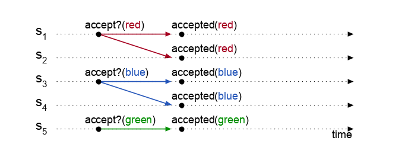
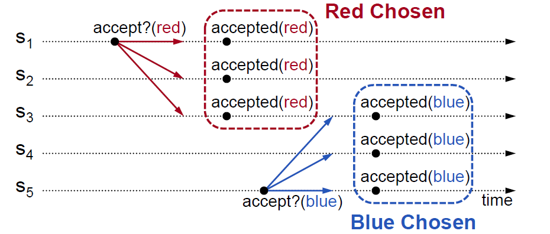
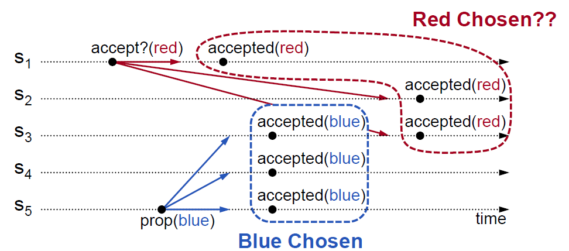
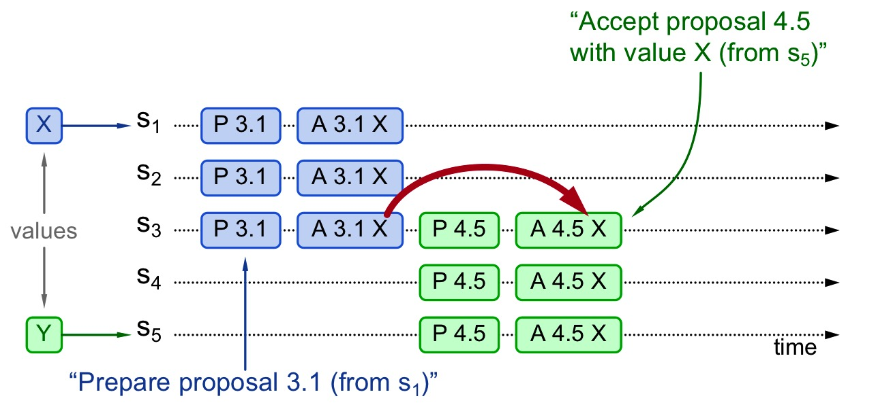
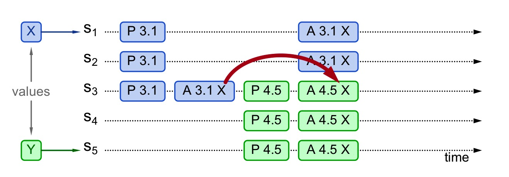
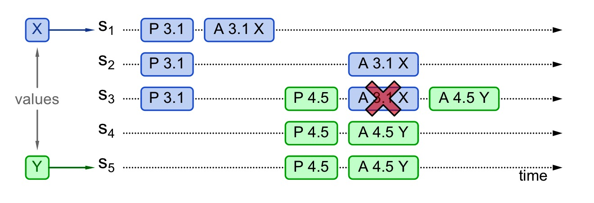
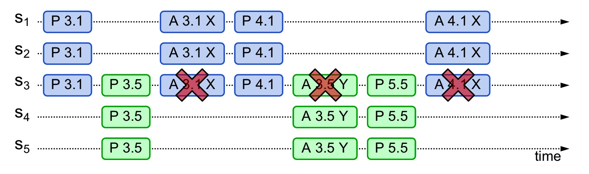

<!-- migrated-from: https://tangwz.com/posts/202009-basic-paxos/ -->

> Google Chubby 的作者 Mike Burrows 说过：There is only one consensus protocol, and that’s Paxos.

# 引言

上文我们已经详细的阐述了共识问题并介绍了一些共识算法，其中 Paxos 算法是 Leslie Lamport 于 1990 年提出的共识算法，不幸的是采用希腊民主议会的比喻很明显失败了，Lamport 像写小说一样，把一个复杂的数学问题弄成了一篇带有考古色彩的历史小说。根据 [Lamport 自己的描述](http://lamport.azurewebsites.net/pubs/pubs.html#lamport-paxos)，三个审阅人都认为该论文尽管并不重要但还有些意思，只是应该把其中所有 Paxos 相关的故事背景删掉才能发表。Lamport 对这些缺乏幽默感的人感到生气，他不打算对论文做任何修改，论文也没有得以发表。

多年后，两个在 SRC(_Systems Research Center，DEC 于 1984 年创立，Lamport 也曾在此工作过_)工作的人需要为他们正在构建的分布式系统寻找一些合适算法，而 Paxos 恰恰提供了他们想要的。Lamport 就将论文发给他们，他们也没觉得该论文有什么问题。

因此，Lamport 觉得论文重新发表的时间到了，"[The Part-Time Parliament](https://lamport.azurewebsites.net/pubs/lamport-paxos.pdf)" 最终在 1998 年公开发表。

可是很多人抱怨这篇论文根本看不懂啊，人们只记住了那个奇怪的故事，而不是 Paxos 算法。Lamport 走到哪都要被人抱怨一通。于是他忍无可忍，2001 年重新发表了一篇关于 Paxos 的论文——"[Paxos Made Simple](https://lamport.azurewebsites.net/pubs/paxos-simple.pdf)"，这次论文中一个公式也没有，摘要也只有一句话：

> The Paxos algorithm, when presented in plain English, is very simple.

满满的都是嘲讽！

然而，可能是表述顺序的原因，这篇论文还是非常难以理解，于是人们写了一系列文章来解释这篇论文（重复造论文），以及在工程上如何实现它。

其中，个人认为讲解 Paxos 最好的[视频](https://www.youtube.com/watch?v=JEpsBg0AO6o)来自于 Raft 算法作者 Diego Ongaro，本文采用 Diego 讲义中的图片来理解 Paxos 算法，也纠正了一个个人认为 Diego 笔误的地方。

# 术语

## 基本概念

- Proposal Value：提案的值；
- Proposal Number：提案编号；
- Proposal：提案 = 提案编号 + 提案的值；
- Chosen：批准，也叫选定。一旦某个值被 Chosen，后续 Paxos 都必须用该值进行交互。

> 注：Proposal 有人叫“提议”有人叫“提案”，此处和维基百科里的翻译保持一致，叫“提案”。

## 角色

- Proposer：提案发起者；
- Acceptor：提案接收者；
- Learner：提案学习者；

# 问题描述

为了高可用性，一种常见的设计是用一个 master 节点来写，然后复制到各个 slave 节点。这种解决方法的问题在于，一旦 master 节点故障，整个服务将不可用或者数据不一致。

为了克服单点写入问题，于是有了多数派（Quorum）写，思路就是写入一半以上的节点。即，如果集群中有 N 个节点，客户端需要写入 W >= N/2 + 1 个节点。不需要主节点。这种方法可以容忍最多 (N-1)/2 个节点故障。

但是问题依然存在：每个接收者该如何决定是否接受这次请求的值呢？

如果我们接受第一次收到的值，那么当出现以下情况（Split Votes），则没有出现多数派，没有一个值被 Chosen，算法无法终止，这违反了**活性（liveness）**。



为了解决 Split Votes 问题，我们允许接受多个不同的值，收到的**每一个**请求都接受，这时候新的问题出现了，如下，可能不止一个值被 Chosen，这违反了**安全性（safety）**。



注意，Paxos 强调：

> Once a value has been chosen, future proposals must propose the same value.

也就是说，我们讨论的 Basic-Paxos 只会 Chosen 一个值。基于此，就需要一个两阶段（2-phase）协议，对于已经 Chosen 的值，**后续的提案**也要使用相同的值。

如下图这种情况，S3 直接拒绝 `red` 值，因为 `blue` 已经 Chosen，这样就可以保证成功。



这种方式我们需要对提案进行排序。如果你熟悉分布式系统，应该能想到 “[Time, Clocks and the Ordering of Events in a Distributed System](http://lamport.azurewebsites.net/pubs/time-clocks.pdf)” 这篇论文，我们不能用时间来判断提案的先后顺序。

# Proposal Number

一种简单的方式就是每个请求一个唯一的编号，例如：`<seq_id, server_id>`，为了排序 `seq_id` 是自增的；同时为了避免崩溃重启，必须能在本地持久化存储。

# Paxos

现在我们终于可以开始描述 Paxos 算法了。

如上所述，Paxos 是一个两阶段算法。我们把第一个阶段叫做准备（Prepare）阶段，第二个阶段叫做接受（Accept）阶段。分别对应两轮 RPC。

## 第一轮 Prepare RPCs：

### 请求（也叫 Prepare 阶段）：

Proposer 选择一个提案编号 n，向**超过半数**的 Acceptor 广播 `Prepare(n)` 请求。

> 注：这里讲义的算法流程图是向所有的 Acceptor 发起 `Prepare()` 请求，鄙人认为应该改为向多数派 Acceptor 发起。参考论文原文： Phase 1. (a) A proposer selects a proposal number n and sends a prepare request with number n to a majority of acceptors.

**这里 Prepare（n）不包含提案的值。**

伪代码：

```c++
send PREPARE(++n)
```

### 响应（也叫 PROMISE 阶段）：

Acceptor 接收到 `Prepare（n)` 请求，此时有两种情况：

- 如果 n 大于之前接受到的所有 Prepare 请求的编号，则返回 `Promise()` 响应，并承诺将不会接收编号小于 n 的提案。如果有提案被 Chosen 的话，`Promise()` 响应还应包含前一次提案编号和对应的值。
- 否则（即 n 小于等于 Acceptor 之前收到的最大编号）忽略，但常常会回复一个拒绝响应。

**所以，Acceptor 需要持久化存储 max_n、accepted_N 和 accepted_VALUE。**

伪代码：

```c++
if (n > max_n)
    max_n = n     // save highest n we've seen so far
    if (proposal_accepted == true) // was a proposal already accepted?
        respond: PROMISE(n, accepted_N, accepted_VALUE)
    else
        respond: PROMISE(n)
else
    do not respond (or respond with a "fail" message)
```

## 第二轮 Accept RPCs：

### 请求（也叫 PROPOSE 阶段）：

当 Proposer 收到**超过半数 Acceptor** 的 `Promise()` 响应后，Proposer 向**多数派**的 Acceptor 发起 `Accept(n, value)` 请求并带上提案编号和值。（注：这里讲义的算法流程图是向所有的 Acceptor 发起 `Accept()` 请求，鄙人认为应该改为向多数派 Acceptor 发起。）

**注意：Proposer 不一定是将 `Accept()` 请求发给有应答的多数派 Acceptors，可以再选另一个多数派 Acceptors 广播 `Accept()` 请求。**

\*\*关于值 value 的选择：\*\*如果前面的 Promise 响应有返回 `accepted_VALUE`，那就使用这个值作为 value。如果没有返回 `accepted_VALUE`，那可以自由决定提案值 value。

伪代码：

```c++
did I receive PROMISE responses from a majority of acceptors?
if yes
    do any responses contain accepted values (from other proposals)?
    if yes
        val = accepted_VALUE    // value from PROMISE message with the highest accepted ID
    if no
        val = VALUE     // we can use our proposed value
    send Accept(ID, val) to at least a majority of acceptors
```

### 响应（也叫 ACCEPT 阶段）：

Acceptor 收到 `Accept()` 请求，在这期间如果 Acceptor 没有对比 n 更大的编号另行 Promise，则接受该提案。

伪代码：

```c++
if (n >= max_n) // is the n the largest I have seen so far?
    proposal_accepted = true     // note that we accepted a proposal
    accepted_N = n             // save the accepted proposal number
    accepted_VALUE = VALUE       // save the accepted proposal data
    respond: Accepted(N, VALUE) to the proposer and all learners
else
    do not respond (or respond with a "fail" message)
```

## Notes

值得注意的是，只有 Proposer 知道某个提案的值是否被 Chosen，如果其它节点想知道某个值是否被 Chosen，那就必须用该值发起一次提案，执行一次 Paxos 算法。

# 一些例子

## 情况 1：提案已 Chosen



1.  S1 收到客户端提案请求 X，于是 S1 向 S1-S3 发起 `Prepare(3.1)` 请求，`PROMISE()` 响应返回没有提案被 Chosen
2.  由于 S1-S3 没有任何提案被 Chosen，S1 继续向 S1-S3 发送 `Accept(3.1, X)` 请求，提案被成功 Chosen
3.  在提案被 Chosen 后，S5 收到客户端提案值为 Y 的请求，向 S3-S5 发送 `Prepare(4.5)` 请求，由于编号 4 > 3 会收到提案值为 X 已经被 Chosen 的 `PROMISE()` 响应
4.  于是 S5 **将提案值 Y 替换成 X**，向 S1-S3 发送 `Accept(4.5, X)` 请求，提案再次被 Chosen

## 情况 2：提案未 Chosen，Proposer 可见



情况 2 和情况 1 类似，在 S3 Chosen 了提案后，S5 收到来自 S3 的 `PROMISE()` 响应包含了已经 Chosen 的提案值 X，所以同样会将提案值替换成 X，最终所有 Acceptor 对 X 达成共识。

注意上面的伪代码：`do any responses contain accepted values`，也就是说只要有一个 Acceptor 在 `Promise()` 响应中返回了提案值，就要用它来替换提案值。

## 情况 3：提案未提交，Proposer 不可见



情况 3 中，提案只被 S1 Chosen，S3 还未 Chosen 该提案，S3-S5 的 `Promise()` 响应中没有任何提案信息，所以 S5 自行决定提案值为 Y，发送 `Accept(4.5, Y)` 请求。

由于此时 S3 承诺的提案编号 n 变为了 4 且 4 大于 3，所以 S3 不再接受 S1 后续的 `Accept(3.1, X)` 请求。提案值 X 被阻止，而提案值 Y 最终被 Chosen。

# 活锁



如图：当 Proposer 在第一轮 Prepare 发出请求，还没来得及后续的第二轮 Accept 请求，紧接着第二个 Proposer 在第一阶段也发出编号更大的请求。如果这样无穷无尽，Acceptor 始终停留在决定顺序号的过程上，那大家谁也成功不了。

解决活锁最简单的方式就是引入**随机超时**，这样可以让某个 Proposer 先进行提案，减少一直互相抢占的可能。

# 结语

Paxos 只从一个或多个值中选择一个值，如果需要重复运行 Paxos 来创建复制状态机，我们称之为 multi-Paxos，但如果每个命令都通过一个Basic Paxos算法实例来达到一致，会产生大量开销。对于 multi-Paxos 可以做一些优化，我们在下篇文章中讨论 Paxos 的变种。
