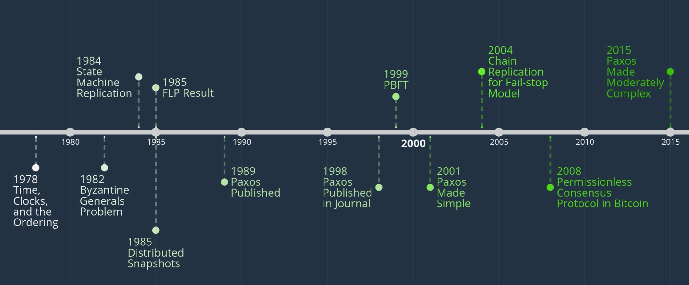
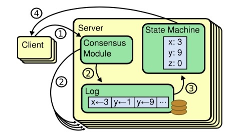
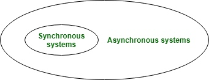
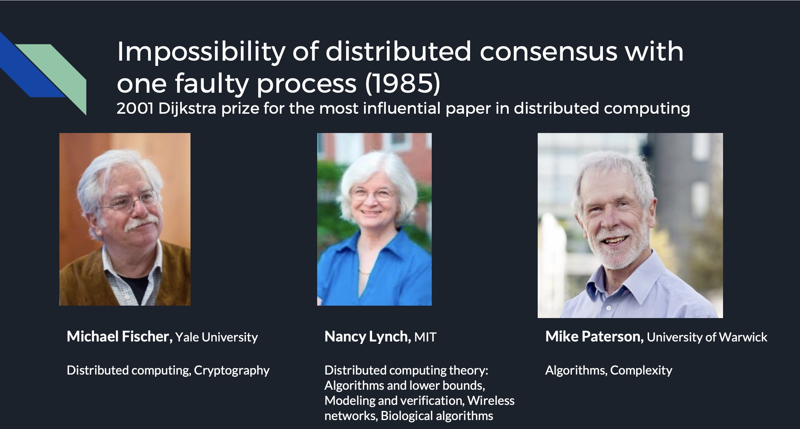
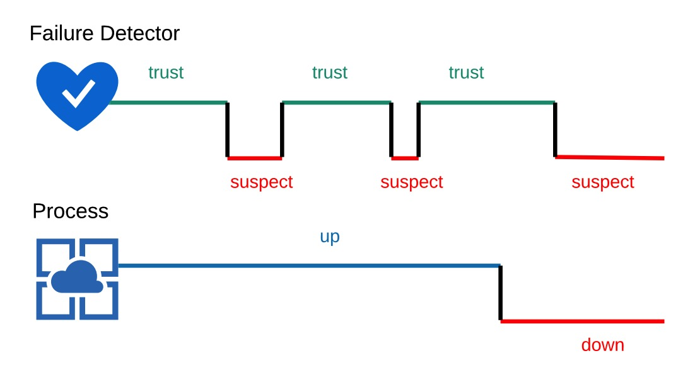

<!-- migrated-from: https://tangwz.com/posts/202009-consensus/ -->

## 混乱的“一致性”问题

Consensus != Consistency

受翻译影响，网上很多讨论 paxos 或 raft 的博客使用“分布式一致性协议”或者“分布式一致性算法”这样的字眼，虽然在汉语中“达成共识”和“达成一致”是一个意思，但是必须要说明在这里讨论的是 consensus 问题，使用“共识”来表达更清晰一些。而 CAP 定理中的 C 和数据库 ACID 的 C 才是真正的“一致性”—— consistency 问题，尽管这两个 C 讨论的也不是同一个问题，但在这里不展开。

为了规范和清晰表达，在讨论 consensus 问题的时候统一使用“共识”一词。

注：在早些的文献中，共识（consensus）也叫做协商（agreement）。

## 共识问题

那么共识问题到底是什么呢？举个生活中的例子，小明和小王出去聚会，小明问：“小王，我们喝点什么吧？” 小王：“喝咖啡怎么样？” 小明：“好啊，那就来杯咖啡。”

在上面的场景中，小王**提议**喝一杯咖啡，小明表示**同意**，两人就“喝杯咖啡”这个问题达成共识，并根据这个结果采取行动。这就是生活中的共识。

在分布式系统中，**共识**就是系统中的多个节点对某个值达成一致。共识问题可以用数学语言来描述：一个分布式系统包含 n 个进程 {0, 1, 2,…, n-1}，每个进程都有一个初值，进程之间互相通信，设计一种算法使得尽管出现故障，进程们仍协商出某个不可撤销的最终决定值，且每次执行都满足以下三个性质：

- 终止性（Termination）：所有正确的进程最终都会认同某一个值。
- 协定性（Agreement）：所有正确的进程认同的值都是同一个值。
- 完整性（Integrity），也称作有效性（Validity）：如果正确的进程都提议同一个值，那么所有处于认同状态的正确进程都选择该值。

完整性可以有一些变化，例如，一种较弱的完整性是认定值等于某些正确经常提议的值，而不必是所有进程提议的值。完整性也隐含了，最终被认同的值必定是某个节点提出过的。

## 为什么要达成共识？

我们首先介绍分布式系统达成共识的动机。

在[前文](/posts/202008-intro-distributed-system/)中，我们已经了解到分布式系统的几个主要难题：

- 网络问题
- 时钟问题
- 节点故障问题

[第一篇提到共识问题的文献](http://betathoughts.blogspot.com/2007/06/brief-history-of-consensus-2pc-and.html)[^1] 来自于 lamport 的 “[Time, Clocks and the Ordering of Events in a Distributed System](http://research.microsoft.com/users/lamport/pubs/time-clocks.pdf)[^2]"，尽管它并没有明确的提出共识(consensus)或者协商(agreement)的概念。论文阐述了在分布式系统中，你无法判断事件 A 是否发生在事件 B 之前，除非 A 和 B 存在某种依赖关系。由此还引出了分布式**状态机**的概念。

在分布式系统中，共识就常常应用在这种多副本状态机（Replicated state machines），状态机在每台节点上都存有副本，这些状态机都有相同的初始状态，每次状态转变、下个状态是什么都由相关进程共同决定，每一台节点的日志的值和顺序都相同。每个状态机在“哪个状态是下一个需要处理的状态”这个问题上达成共识，这就是一个共识问题。

最终，这些节点看起来就像一个单独的、高可靠的状态机。[Raft 的论文](https://www.usenix.org/system/files/conference/atc14/atc14-paper-ongaro.pdf)[^3]提到，使用状态机我们就能克服上述三个问题：

- 满足在所有非拜占庭条件下确保安全（不会返回错误结果），包括网络延迟、分区、丢包、重复和重排序。
- 不依赖于时序。
- 高可用。只要集群中的大部分节点正常运行，并能够互相通信且可以同客户端通信，这个集群就完全可用。因此，拥有5个节点的集群可以容忍其中的2个节点失败。假使通过停掉某些节点使其失败，稍后它们会从持久化存储的状态进行恢复，并重新加入到集群中。

不仅如此，达成共识还可以解决分布式系统中的以下经典问题：

- 互斥（Mutual exclusion）：哪个进程进入临界区访问资源？分布式锁？
- 选主（Leader election）：在单主复制的数据库，需要所有节点就哪个节点是领导者达成共识。如果一些由于网络故障而无法与其他节点通信，可能会产生两个领导者，它们都会接受写入，数据就可能会产生分歧，从而导致数据不一致或丢失。
- 原子提交（Atomic commit）：跨多节点或跨多分区事务的数据库中，一个事务可能在某些节点上失败，但在其他节点上成功。如果我们想要维护这种事务的原子性，必须让所有节点对事务的结果达成共识：要么全部提交，要么全部中止/回滚。

总而言之，在共识的帮助下，分布式系统就可以像单一节点一样工作——所以共识问题是分布式系统最基本的问题。

## 系统模型

在考虑如何达成共识之前，需要考虑分布式系统中有哪些可供选择的计算模型。主要有以下几个方面：

网络模型：

- 同步（Synchronous）：响应时间是在一个固定且已知的有限范围内。
- 异步（Asynchronous）：响应时间是无限的。

故障类型：

- Fail-stop failures：节点突然宕机并停止响应其它节点。
- [Byzantine failures](https://en.wikipedia.org/wiki/Byzantine_fault)：源自“拜占庭将军问题” ，是指节点响应的数据会产生无法预料的结果，可能会互相矛盾或完全没有意义，这个节点甚至是在“说谎”，例如一个被黑客入侵的节点。

消息模型：

- 口头消息(oral messages)：消息被转述的时候是可能被篡改的。
- 签名消息(signed messages)：消息被发出来之后是无法伪造的，只要被篡改就会被发现。

作为最常见的，我们将分别讨论在同步系统和异步系统中的共识。在同步通信系统中达成共识是可行的(下文将会谈论这点)，但是，在实际的分布式系统中同步通信是不切实际的，我们不知道消息是故障了还是延迟了。异步与同步相比是一种更通用的情况。一个适用于异步系统的算法，也能被用于同步系统，但是反过来并不成立。

让我们先从异步的情况开始。

## 异步系统中的共识

### FLP 不可能（FLP Impossibility）

早在 1985 年，Fischer、Lynch 和 Paterson （FLP）在 “[Impossibility of Distributed Consensus with One Faulty Process](https://groups.csail.mit.edu/tds/papers/Lynch/jacm85.pdf)”[^4] 证明了：在一个**异步**系统中，即使只有一个进程出现了故障，也没有算法能**保证**达成共识。

简单来说，因为在一个异步系统中，进程可以随时发出响应，所以没有办法分辨一个进程是速度很慢还是已经崩溃，这不满足终止性（Termination）。详细的证明已经超出本文范围，不在细述[^5]。

此时，人们意识到一个分布式共识算法需要具有的两个属性：**安全性(safety)**和**活性(liveness)**。安全性意味着所有正确的进程都认同同一个值，活性意味着分布式系统最终会认同某一个值。每个共识算法要么牺牲掉一个属性，要么放宽对网络异步的假设。

虽然 FLP 不可能定理听着让人望而生畏，但也给后来的人们提供了研究的思路——不再尝试寻找异步通信系统中共识问题完全正确的解法。FLP 不可能是指无法确保达成共识，并不是说如果有一个进程出错，就永远无法达成共识。**这种不可能的结果来自于算法流程中最坏的结果**：

- 一个完全异步的系统
- 发生了故障
- 最后，不可能有一个确定的共识算法。

针对这些最坏的情况，可以找到一些方法，尽可能去绕过 FLP 不可能，能满足大部分情况下都能达成共识。[《分布式系统：概念与设计》](https://book.douban.com/subject/21624776/)提到一般有三种办法：

1.  故障屏蔽（Fault masking）
2.  使用故障检测器（Failure detectors）
3.  使用随机性算法（Non-Determinism）

### 1、故障屏蔽（Fault masking）

既然异步系统中无法证明能够达成共识，我们可以将异步系统转换为同步系统，故障屏蔽就是第一种方法。故障屏蔽假设故障的进程最终会恢复，并找到一种重新加入分布式系统的方式。如果没有收到来自某个进程的消息，就一直等待直到收到预期的消息。

例如，两阶段提交事务使用持久存储，能够从崩溃中恢复。如果一个进程崩溃，它会被重启（自动重启或由管理员重启）。进程在程序的关键点的持久存储中保留了足够多的信息，以便在崩溃和重启时能够利用这些数据继续工作。换句话说故障程序也能够像正确的进程一样工作，只是它有时候需要很长时间来执行一个恢复处理。

故障屏蔽被应用在各种系统设计中。

### 2、使用故障检测器（Failure detectors）

将异步系统转换为同步系统的第二个办法就是引入故障检测器，进程可以认为在超过一定时间没有响应的进程已经故障。一种很常见的故障检测器的实现：超时（timeout）。

但是，这种办法要求故障检测器是精确的。如果故障器不精确的话，系统可能放弃一个正常的进程；如果超时时间设定得很长，进程就需要等待（并且不能执行任何工作）较长的时间才能得出出错的结论。这个方法甚至有可能导致网络分区。

解决办法是使用“不完美”的故障检测器。Chanadra 和 Toueg 在 “[The weakest failure detector for solving consensus](https://dl.acm.org/doi/10.1145/234533.234549)[^6]” 中分析了一个故障检测器必须拥有的两个属性：

- 完全性（Completeness）：每一个故障的进程都会被每一个正确的进程怀疑。
- 精确性（Accuracy）：正确的进程没有被怀疑。

同时，他们还证明了，即使是使用不可靠的故障检测器，只要通信可靠，崩溃的进程不超过 N/2，那么共识问题是可以解决的。我们不需要实现 Strong Completeness 和 Strong Accuracy，只需要一个最终弱故障检测器（eventually weakly failure detector），该检测器具有如下性质：

- 最终弱完全性（eventually weakly complete）：每一个错误进程最终常常被一些正确进程怀疑；
- 最终弱精确性（eventually weakly accurate）：经过某个时刻后，至少一个正确的进程从来没有被其它正确进程怀疑。

该论文还证明了，在异步系统中，我们不能只依靠消息来实现一个最终弱故障检测器。但是，实际的故障检测器能够根据观察到的响应时间调节它的超时值。如果一个进程或者一个到检测器的连接很慢，那么超时值就会增加，那么错误地怀疑一个进程的情况将变得很少。从实用目的来看，这样的弱故障检测器与理想的最终弱故障检测器十分接近。

### 3、使用随机性算法(Non-Determinism)

这种解决不可能性的技术是引入一个随机算法，随机算法的输出不仅取决于外部的输入，还取决于执行过程中的随机概率。因此，给定两个完全相同的输入，该算法可能会输出两个不同的值。随机性算法使得“敌人”不能有效地阻碍达成共识。

和传统选出领导、节点再协作的模式不同，像区块链这类共识是基于哪个节点最快计算出难题来达成的。区块链中每一个新区块都由本轮最快计算出数学难题的节点添加，整个分布式网络持续不断地建设这条有时间戳的区块链，而承载了最多计算量的区块链正是达成了共识的主链（即累积计算难度最大）。

比特币使用了 PoW（Proof of Work）来维持共识，一些其它加密货币（如 DASH、NEO）使用 PoS（Proof of Stake），还有一些（如 Ripple）使用分布式账本（ledger）。

但是，这些随机性算法都无法**严格**满足安全性(safety)。攻击者可以囤积巨量算力，从而控制或影响网络的大量正常节点，例如控制 50% 以上网络算力即可以对 PoW 发起[女巫攻击（Sybil Attack）](https://en.wikipedia.org/wiki/Sybil_attack)。只不过前提是攻击者需要付出一大笔资金来囤积算力，实际中这种风险性很低，如果有这么强的算力还不如直接挖矿赚取收益。

## 同步系统中的共识

上述的方法 1 和 2，都想办法让系统比较“同步”。我们熟知的 Paxos 在异步系统中，由于活锁的存在，并没有完全解决共识问题（liveness不满足）。但 Paxos 被广泛应用在各种分布式系统中，就是因为在达成共识之前，系统并没有那么“异步”，还是有极大概率达成共识的。

Dolev 和 Strong 在 “[Authenticated Algorithms for Byzantine Agreement](https://epubs.siam.org/doi/abs/10.1137/0212045?journalCode=smjcat)[^7]” 证明了：**同步系统中，如果 N 个进程中最多有 f 个会出现崩溃故障，那么经过 f + 1 轮消息传递后即可达成共识。**

Fischer 和 Lynch 的 “[A lower bound for the time to assure interactive consistency](https://www.sciencedirect.com/science/article/abs/pii/0020019082900333)[^8]” 证明了，**该结论同样适用于拜占庭故障**。

基于此，大多数实际应用都依赖于同步系统或部分同步系统的假设。

### 同步系统中的拜占庭将军问题

Leslie Lamport、Robert Shostak 和 Marshall Pease 在 “[拜占庭将军问题（The Byzantine General’s Problem)](http://people.cs.uchicago.edu/~shanlu/teaching/33100_wi15/papers/byz.pdf)[^9]” 论文中讨论了 3 个进程互相发送未签名（口头的）的消息，并证明了只要有一个进程出现故障，就无法满足拜占庭将军的条件。但如果使用签名的消息，那么 3 个将军中有一个出现故障，也能实现拜占庭共识。

Pease 将这种情况推广到了 N 个进程，也就是在一个有 f 个拜占庭故障节点的系统中，必须总共至少有 3f + 1 个节点才能够达成共识。即 N >= 3f + 1。

虽然同步系统下拜占庭将军问题的确存在解，但是代价很高，需要 O(N^f+1 ) 的信息交换量，只有在那些安全威胁很严重的地方使用（例如：航天工业）。

#### PBFT 算法

[PBFT(Practical Byzantine Fault Tolerance)](http://pmg.csail.mit.edu/papers/osdi99.pdf) [^10] 算法顾名思义是一种实用的拜占庭容错算法，由 Miguel Castro 和 Barbara Liskov 发表于 1999 年。

算法的主要细节不再展开。PBFT 也是通过使用同步假设保证活性来绕过 FLP 不可能。PBFT 算法容错数量同样也是 N >= 3f + 1，但只需要 O(n^2 ) 信息交换量，即每台计算机都需要与网络中其他所有计算机通讯。

虽然 PBFT 已经有了一定的改进，但在大量参与者的场景还是不够实用，不过在拜占庭容错上已经作出很重要的突破，一些重要的思想也被后面的共识算法所借鉴。

## 结语

本文参考了很多资料文献，对“共识问题”的研究历史做一些基础概述，希望能对你带来一点帮助。

本文提到的论文，很多直接谈论结果，忽略了其中的数学证明，一是本文只是提纲挈领的讨论共识问题，建立一个知识框架，后续方便往里面填充内容；二是考虑到大部分读者对数学证明过程并不敢兴趣，也不想本文变成一本书那么长。本文也遗漏许多重要算法，后续如有必要会继续补充。

限于本人能力，恳请读者们对本文存在的错误和不足之处，欢迎留言或私信告诉我。

下篇我们将会讨论 Paxos 算法。

## Reference

[^1]: Mark Mc Keown: “[A brief history of Consensus, 2PC and Transaction](http://betathoughts.blogspot.com/2007/06/brief-history-of-consensus-2pc-and.html)”

[^2]: Leslie Lamport: “[Time, Clocks and the Ordering of Events in a Distributed System](http://research.microsoft.com/users/lamport/pubs/time-clocks.pdf)”

[^3]: Diego Ongaro and John Ousterhout: “[In Search of an Understandable Consensus Algorithm](https://www.usenix.org/system/files/conference/atc14/atc14-paper-ongaro.pdf)”

[^4]: Fischer、Lynch and Paterson; “[Impossibility of Distributed Consensus with One Faulty Process](https://groups.csail.mit.edu/tds/papers/Lynch/jacm85.pdf)”

[^5]: [A Brief Tour of FLP Impossibility](http://the-paper-trail.org/blog/a-brief-tour-of-flp-impossibility/)

[^6]: Chanadra and Toueg: “[The weakest failure detector for solving consensus](https://dl.acm.org/doi/10.1145/234533.234549)”

[^7]: [Authenticated Algorithms for Byzantine Agreement](https://epubs.siam.org/doi/abs/10.1137/0212045?journalCode=smjcat)

[^8]: [A lower bound for the time to assure interactive consistency](https://www.sciencedirect.com/science/article/abs/pii/0020019082900333)

[^9]: Leslie Lamport, Robert Shostak, and Marshall Pease: “[The Byzantine General’s Problem](http://people.cs.uchicago.edu/~shanlu/teaching/33100_wi15/papers/byz.pdf)”

[^10]: [Practical Byzantine Fault Tolerance](http://pmg.csail.mit.edu/papers/osdi99.pdf)
