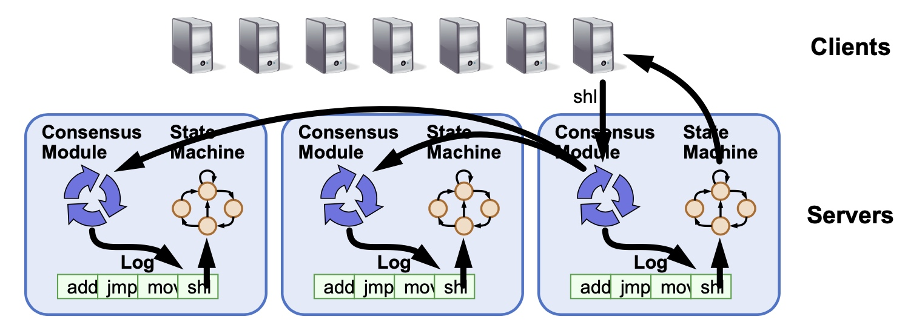
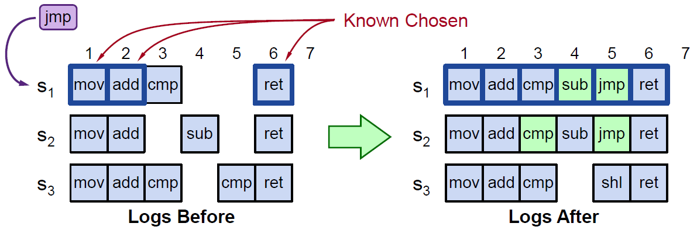
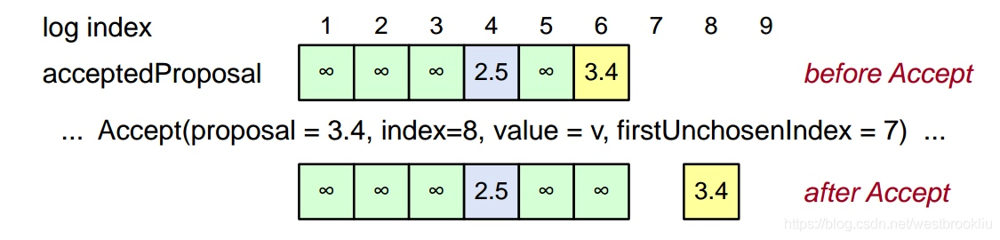
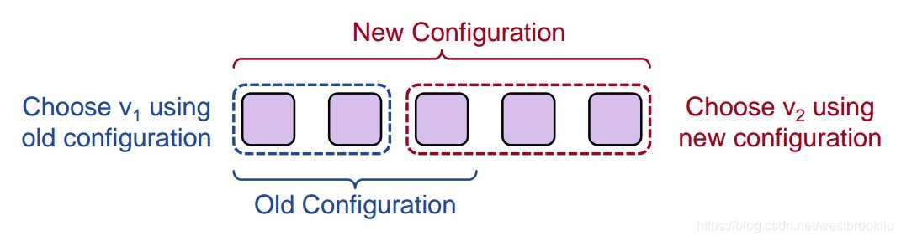
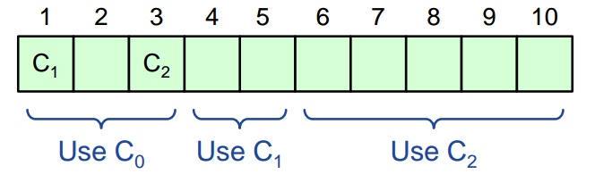

<!-- migrated-from: https://tangwz.com/posts/202010-multi-paxos/ -->

分布式系统为了实现**多副本状态机（Replicated state machine）**，常常需要一个多副本日志（Replicated log）系统，[这个原理受到简单的经验常识启发](https://engineering.linkedin.com/distributed-systems/log-what-every-software-engineer-should-know-about-real-time-datas-unifying)：如果日志的内容和顺序都相同，多个进程从同一状态开始，并且以相同的顺序获得相同的输入，那么这些进程将会生成相同的输出，并且结束在相同的状态。

Replicated log => Replicated state machine

问题是：

> 如何保证日志数据在每台机器上都一样？

当然是一直在讨论的 Paxos。一次独立的 Paxos 代表日志中的一条记录，重复运行 Paxos 即可创建一个 Replicated log。

但是如果每一组提案值都通过一次 Paxos 算法实例来达成共识，每次都要两轮 RPC，会产生大量开销。所以需要对 Paxos 做一些调整解决更实际的问题，并提升性能。经过一系列优化后的 Paxos 我们称之为 Multi-Paxos。

> Multi-Paxos 的目标就是实现 Replicated log.

下面我们从第一个问题开始。

## 如何确定是哪条日志记录？

首先，Replicated log 类似一个数组，我们需要知道当次请求是在写日志的第几位。因此，Multi-Paxos 做的第一个调整就是要添加一个日志的 index 参数到 `Prepare` 和 `Accept` 阶段，表示这轮 Paxos 正在决策哪一条日志记录。

现在流程大致如下，当收到客户端带有提案值的请求时：

1.  找到第一个没有 chosen 的日志记录
2.  运行 Basic Paxos，对这个 index 用客户端请求的提案值进行提案
3.  Prepare 是否返回 `acceptedValue`？
    - 是：用 `acceptedValue` 跑完这轮 Paxos，然后回到步骤 1 继续处理
    - 否：chosen 客户端提案值

### 举个例子

如图所示，首先，服务器上的每条日志记录可能存在三种状态：

- 已经保存并知道被 chosen 的日志记录，例如 S1 方框加粗的第 1、2、6 条记录（后面会介绍服务器如何知道这些记录已经被 chosen）
- 已经保存但不知道有没有被 chosen，例如 S1 第 3 条 `cmp` 命令。观察三台服务器上的日志，cmp 其实已经存在两台上达成了多数派，只是 S1 还不知道
- 空的记录，例如 S1 第 4、5 条记录，S1 在这个位置没有接受过值，但可能在其它服务器接受过：例如 S2 第 4 条接受了 `sub`，S3 第 5 条接受了 `cmp`

我们知道三台机可以容忍一台故障，为了更具体的分析，我们假设此时**是 S3 宕机的情况**。同时，这里的提案值是一条具体的命令。当 S1 收到客户端的请求命令 `jmp` 时，：

1.  找到第一个没有 chosen 的日志记录：图示中是第 3 条 `cmp` 命令。
2.  这时候 S1 会尝试让 `jmp` 作为第 3 条的 chosen 值，运行 Paxos。
3.  因为 S1 的 Acceptor 已经接受了 `cmp`，所以在 Prepare 阶段会返回 `cmp`，接着用 `cmp` 作为提案值跑完这轮 Paxos，s2 也将接受 `cmp` 同时 S1 的 `cmp` 变为 chosen 状态，然后继续找下一个没有 chosen 的位置——也就是第 4 位。
4.  S2 的第 4 个位置接受了 `sub`，所以在 Prepare 阶段会返回 `sub`，S1 的第 4 位会 chosen `sub`，接着往下找。
5.  第 5 位 S1 和 S2 都为空，不会返回 `acceptedValue`，所以第 5 个位置就确定为 `jmp` 命令的位置，运行 Paxos，并返回请求。

值得注意的是，这个系统是可以并行处理多个客户端请求，比如 S1 知道 3、4、5、7 这几个位置都是未 chosen 的，就直接把收到的 4 个命令并行尝试写到这四个位置。但是，如果是状态机要执行日志时，必须是按照日志顺序逐一输入，如果第 3 条没有被 chosen，即便第 4 条已经 chosen 了，状态机也不能执行第 4 条命令。

还记得我们之前文章里说的活锁。如果所有的 Proposer 都一起并行工作，因 Proposer 间大量的冲突而需要更多轮 RPC 才能达成共识的可能性就很大。另外，**每个提案最优情况下还是需要两轮 RPC** ！

一般通过以下方式优化：

- 选择一个Leader，任意时刻只有它一个 Proposer，这样可以避免冲突
- 减少大部分 Prepare 请求，只需要对整个日志进行一次 Prepare，后面大部分日志可以通过一次 Accept 被 chosen

下面谈谈这两个优化。

## Leader 选举

有很多办法可以进行选举，Lamport 提出了一种简单的方式：让 server_id 最大的节点成为Leader（在[上篇](/posts/202009-basic-paxos/)说到提案编号由自增 id 和 server_id 组成，就是这个 server_id）。

1.  既然每台服务器都有一个 server_id，我们就直接让 server_id 最大的服务器成为 Leader，这意味着每台服务器需要知道其它服务器的 server_id
2.  为此，每个节点每隔 Tms 向其它服务器发送心跳
3.  如果一个节点在 2Tms 时间内没有收到比自己 server_id 更大的心跳，那它自己就转为 Leader，意味着：
    - 该节点处理客户端请求
    - 该节点同时担任 Proposer 和 Acceptor
4.  如果一个节点收到比自己 server_id 更大的服务器的心跳，那么它就不能成为 Leader，意味着：
    - 该节点拒绝掉客户端请求，或者将请求重定向到 Leader
    - 该节点只能担任 Acceptor

值得注意的是，这是非常简单的策略，这种方式系统中同时有两个 Leader 的概率是较小的。**即使是系统中有两个 Leader，Paxos 也是能正常工作的，只是冲突的概率就大了很多，效率也会降低。**

有一些基于租约的策略显得更为稳定，也更复杂，在此不表。

## 减少 Prepare 请求

在讨论如何减少 Prepare 请求之前，先讨论下 Prepare 阶段的作用，需要 Prepare 有两个原因：

1.  屏蔽老的提案：但 Basic-Paxos 只作用在日志的一条记录
2.  检查可能已经被 chosen 的 value 来代替原本的提案值：多个 Proposer 并发进行提案的时候，新的 Proposal 要确保提案的值相同

我们**依然是需要 Prepare 的**。我们要做的是减少大部分 Prepare 请求，首先要搞定这两个功能。

对于 1，我们不再让提案编号只屏蔽一个 index 位置，而是让它变成全局的，即屏蔽整个日志。一旦 Prepare 成功，整个日志都会阻塞（值得注意的是，Accept 阶段还是只能写在对应的 index 位置上）。

对于2，需要拓展 Prepare 请求的返回信息，和之前一样，Prepare 还是会返回最大提案编号的 `acceptedValue`，除此之外，Acceptor 还会向后查看日志记录，如果要写的这个位置之后都是空的记录，没有接受过任何值，那么 Acceptor 就额外返回一个标志位 `noMoreAccepted`。

后续，如果 Leader 接收到超过半数的 Acceptor 回复了 `noMoreAccepted`，那 Leader 就不需要发送 Prepare 请求了，直接发送 Accept 请求即可。这样只需要一轮 RPC。

## 副本的完整性

目前为止，通过选主和减少 Prepare 请求之后的 Multi-Paxos 依然不够完整，还需要解决：

- 之前的日志只需要被多数派接受，完整的日志记录需要复制到全部节点
- 只有 Proposer（也就是Leader） 知道哪些记录被 chosen 了，需要所有的服务器都知道哪些记录被 chosen

换句话说，我们需要每台机的日志都完整，这样状态机执行日志后才能达到一样的状态。

要做到这点，我们需要：

1.  为了让日志尽可能被复制到每台服务器：Leader 在收到多数派 Acceptor 回复后，可以继续做后面的处理，但同时在后台继续对未回复的 Acceptor 进行重试。这样不会影响客户端的响应时间，但这也不能确保完全复制了（例如，如果 Leader 在中途宕机了）
2.  为了追踪哪些记录是被 chosen 的，我们增加一些内容：
    - `acceptedProposal` 代表日志的提案编号，如果第 i 条记录被 chosen，则 `acceptedProposal[i] = 无穷大`（这是因为，只有提案编号更大的提案才能被接受，无穷大则表示无法再被重写了）
    - 每个节点都维护一个 `firstUnChosenIndex`，表示第一个没有被 chosen 的日志位置。（即第一个 `acceptedProposal[i] != 无穷大`的节点）
3.  Leader 告诉 Acceptor 哪些日志被 chosen ：Leader 在向 Acceptor 发送 Accept 请求的时候带上 `firstUnChosenIndex`，这样 Acceptor 收到 Accept 请求的时候，如果第 i 条日志满足 `i < request.firstUnchosenIndex && acceptedProposal[i] == request.proposal`，则标记 i 为 chosen（即设为无穷大）

用图示来说明一下，上图表示同一个 Acceptor 节点 Accept 请求前后的 \`\`。该 Acceptor 在 Accept 请求之前的第 6 位的提案编号为 3.4，这时它收到一个提案编号也为 3.4 的 Accept 请求，并且请求的 firstUnchosenIndex = 7，大于之前 3.4 所在的 6，所以**将选中第 6 位，同时因为该请求的 index = 8，acceptedProposal\[8\] == 3.4**

4.  到了这里还需要考虑，Acceptor 的日志条目中仍然可能有一些前任 Leader 留下的提案记录，还没有完成提案的复制或者 chosen 时 Leader 宕机，换了一个 Leader 节点，这时候需要：
    - Acceptor 将其 `firstUnchosenIndex` 作为 Accept 请求的响应返回给 Proposer
    - Proposer 判断如果 `Acceptor.firstUnChosenIndex < Proposer.firstUnChosenIndex`，则在后台（异步）发送 `Success(index, v)` RPC
    - Acceptor 收到 Success RPC 后，更新已经被 chosen 的日志记录：
      - acceptedValue\[index\] = v
      - acceptedProposal\[index\] = 无穷大
      - return firstUnchosenIndex
      - 如果需要(可能存在多个不确定的状态)，Proposer 发送额外的 Success RPC

总结一下，通过 4 个步骤就可以确保所有的 Acceptor 都最终知道 chosen 的日志记录。在一般的情况，并不需要额外的第 4 步，只有在 Leader 切换时才可能需要第 4 步。

现在我们的日志已被完全复制了。因此，让我们转头看看与客户端的交互。

## 客户端请求

接下来需要考虑客户端如何与系统交互。

首先，当客户端第一次请求时，并不知道谁是 Leader，它任意请求一台服务器，如果该服务器不是 Leader，重定向给 Leader。

Leader 直到日志记录被 chosen 并且被 Leader 的状态机执行才返回响应给客户端。

客户端会一直和 Leader 交互，直到无法再联系上它（例如请求超时）。在这种情况下，客户端会联系任何其它服务器，这些服务器又在重定向到实际的 Leader。

但这存在一个问题，如果请求提案被 chosen 后，Leader 在回复客户端之前宕机了。客户端会认为请求失败了，并重试请求。这相当于一个命令会被状态机执行两次，这是不可接受的。

解决办法是客户端为每个请求增加一个唯一 id，服务器将该 id 与命令一起保存到日志记录中。状态机在执行命令之前，会根据 id 检查该命令是否被执行过。

## 集群管理（加入或减少节点）

最后一个非常棘手的问题，因为集群中的节点是会变更的，包括：服务器的 id、网络地址变更和节点数量等。集群节点数量改变会影响多数派数量的判断，我们必须保证不会出现两个重叠的多数派。

Lamport 在 Paxos 论文中的建议解决方案是：使用日志来管理这些变更。当前的集群配置被当作一条日志记录存储起来，并与其它的日志记录一起被复制同步。

这里看起来会比较奇怪，如图所示，第 1、3 个位置存储了两个不同的系统配置，其它位置的日志存储了状态机要执行的命令。增加一个系统参数 𝛼 去控制当配置变更时什么时候去应用它，**𝛼 表示配置多少条记录后才能生效。**

这里假设 𝛼 = 3，意味着 C1 在 3 条记录内不生效，也就是 C1 在第 4 条才会生效， C2 在第 6 条开始生效。

𝛼 是在系统启动的时候就指定的参数。这个参数的大小会限制我们在系统可以同时 chosen 的日志条数：在 `i` 这个位置的值被 chosen 之前，我们不能 chosen `i+α` 这个位置的值——因为我们不知道中间是否有配置变更。

所以，如果 α 值很小，假设是 1，那整个系统就是串行工作了；如果 α = 3，意味着我们可以同时 chosen 3 个位置的值；如果 α 非常大， α = 1000，那事情就会变得复杂，如果我们要变更配置，可能要等配置所在的 1000 条记录都被 chosen 以后才会生效，那要等好一阵子。这时候为了让配置更快生效，我们可以写入一些 `no-op` 指令来填充日志，使得迅速达到需要的条数，而不用一直等待客户端请求进来。

## 总结

首先，描述了如何从 Basic-Paxos 到 Multi-Paxos，如何 chosen 某个位置的日志记录，接着是两个提高 Paxos 效率的办法：选定 Leader 和减少 Prepare 请求。还讲到了如何让所有的服务器都得到完整的日志，系统如何与客户端交互工作。最后，讲了通过 α 值来处理配置变更。

Basic Paxos 流程是比较容易理解的，但 Multi-Paxos 却非常棘手，尤其是实际使用的时候，需要一系列的优化，这一系列优化又是不那么容易理解和做到的。这也是后来的分布式系系统纷纷转投 Raft 的原因之一吧，Paxos 的工程化实在令人头疼。

但不得不说的是，大厂都有自己的 Paxos/Multi-Paxos 实现。Google 的论文 “[Paxos made live](https://www.cs.utexas.edu/users/lorenzo/corsi/cs380d/papers/paper2-1.pdf)” 介绍他们相关的工作，他们的 BigTable、chubby 都是基于文章描述的 Multi-Paxos；微信作为体量巨大的应用，也有开源的 paxos 实现：[phxpaxos](https://github.com/Tencent/phxpaxos)；[阿里的 Oceanbase 也是使用 Paxos](https://www.zhihu.com/question/52337912)——Paxos 可谓分布式系统的皇冠。

下篇文章我们还会继续介绍 Paxos 的其它变体：[Fast-Paxos](https://www.microsoft.com/en-us/research/wp-content/uploads/2016/02/tr-2005-112.pdf)。
