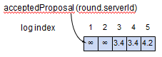
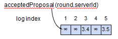
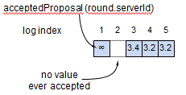
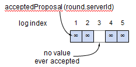

<!-- migrated-from: https://tangwz.com/posts/202010-paxos-exam/ -->

# 试题

## 1.

(4 分）下面的每张图都显示了一种 Multi-Paxos 服务器上可能的日志（每个条目中的数字代表 `acceptedProposal` 值）。考虑每份日志都是独立的，下列日志是否可能发生在正确实现的 Multi-Paxos 中？

a.

b.

c.

d.

## 2.

(6 分) 对于 Basic Paxos，假设一个集群有 5 台服务器，其中 3 台接受了(accepted)提案编号 5.1 和对应的提案值 X，在这种情况下，集群中的**任意服务器**是否有可能接受不同的值 Y ？解释你的答案。

## 3.

(10 分) 假设 Multi-Paxos 集群选出了一个节点作为 Leader，而且没有其它 Leader。此外，假设该节点继续担任一段时间的 Leader，为日志 chosen 了很多命令，并且在这期间依然没有其它节点试图担任 Leader。

a. 在此期间，该节点**最少**要发送多少轮 `Prepare RPC`？给出解释，且尽可能精确。

b. 在此期间，该节点**最多**要发送多少次 `Prepare RPC`？给出解释，且尽可能精确。

## 4.

(5 分) 当一个 Acceptor 使用 Proposer 提供的 `firstUnchosenIndex` 来标记被 chosen 的日志记录时，它必须先检查日志记录中的提案编号（`acceptedProposal[i] == request.proposal`）。假设它跳过了这一检查：请描述一个系统异常的情况。

## 5.

(5 分) 假设提案编号的两个部分（自增 id 和唯一 server_id）进行了互换，即 `server_id` 位于高位。 a. 这会影响 Paxos 的安全性（Safety）吗？请简单解释你的答案。 b. 这会影响 Paxos 的活性（Liveness）吗？请简单解释你的答案。

## 6.

(10 分) 假设一个 Proposer 以初始值 v1 运行 Basic Paxos，但是它在协议执行过程中或执行后的某个（未知）时间点宕机了。假设该 Proposer 重新启动并从头开始运行协议，使用之前使用的相同的提案编号，但初始值为 v2，这样安全吗？请解释你的答案。

## 7.

(10 分) 在一个成功的 `Accept RPC` 中，Acceptor 将其 `minProposal` 设为 n（`Accept RPC` 中的提案编号）。描述一个这样做实际上改变了 `minProposal` 值的场景（即 `minProposal` 还没有等于 n）。描述如果没有这段代码，系统将出现异常行为的场景。

## 8.

(10 分) 考虑 Multi-Paxos 的配置变更，旧配置由服务器 1、2 和 3 组成，新配置由服务器 3、4 和 5 组成。假设新配置在日志中第 N 条被 chosen，同时日志记录 N 到 N+α (含)也都被 chosen。假设此时旧服务器 1 和 2 被关闭，因为它们不属于新配置。描述下这可能在系统中引起的问题。

---

# 答案

## 1.

a. 是。

b. 是。

c. 是。

d. 是。

## 2.

是。如果 S1，S2 和 S3 接受了提案 <5.1, X>，其它服务器仍然可能接受**更早的提案编号**的提案值 Y。

例如，S4 先发送 Prepare(3.4) 发现并没有已接受的提案值，接着 S1 发送 Prepare（5.1）到 S1，S2，S3，然后 S1，S2，S3 接受了<5.1, X>，此时 S4 仍然可能在 S4，S5 完成提案 <3.4, Y>

## 3.

a. 最少只发送 1 轮 `Prepare RPC`，如果多数派 Prepare 都立即返回了具有 `noMoreAccepted=true` 的响应。

b. 最多是： Leader 节点上每有一个未 chosen 但是 Acceptor 已经接受的日志记录，就会有一轮 `Prepare RPC`。这发生在如果每次 Leader 为其没有 chosen 的日志发送 `Prepare` 请求，都发现有一个 Acceptor 已经接受了该提案值，那它就会在该条目位置采用这个提案值，然后继续尝试下一个日志条目。这样就会发生最多的轮次。

## 4.

可能出现的异常行为是：服务器会标记两个不同的 chosen 值。用 2 个竞争的提案，3 节点集群和 2 个日志来举例：

- S1 完成一轮 Prepare 发送提案编号 n=1.1, index=1 给 S1，S2
- S1 只完成 S1（它自己）的 Accept 提案 n=1.1, value = X, index = 1
- S2 完成一轮 Prepare 发送提案编号 n=2.2, index=1 给 S2，S3，收到二者包含 `noMoreAccepted=true` 的响应
- S2 完成一轮 Accept，S2、S3 收到 n=2.2, value=Y, index=1
- S2 标记 index 1 的日志为 chosen
- S2 完成一轮 Accept，S1, S2, 和 S3 收到 n=2.2, value=Z, index=2, firstUnchosenIndex=2，此时，S1 将会发生异常：将 n=1.1, value=X 的日志设为 chosen，然后将 X 应用到状态机。这是不正确的，因为实际上是 Y 被 chosen。

## 5.

a. 不会。因为安全性只需要提案编号唯一，每台服务器的 server_id 是唯一的，并且有自增 id，所以唯一性得到保证。

b. 会。例如，server_id 最大的服务器向集群中每一台服务器发出的 `Prepare RPC` 将会永远失败。然后，其它 Proposer 无法继续运行，因为其它服务器的 `minProposal` 对于 Proposer 来说太大了。

## 6.

不安全。不同的提案必须具有不同的提案编号。下面是一个 3 节点集群的例子：

- S1 发送 `Prepare(n=1.1)` 至 S1，S2
- S1 发送 `Accept(n=1.1, v=v1)` 至 S1
- S1 重启
- S1 发送 `Prepare(n=1.1)` 至 S2，S3（并且发现还没有被接受的提案）
- S1 发送 `Accept(n=1.1, v=v2)` 与 S2，S3
- S1 将 v2 被 chosen 返回给客户端
- S2 发送 `Prepare(n=2.2)` 至 S1，S2 并收到响应：
  - 来自 S1: acceptedProposal=1.1, acceptedValue=v1
  - 来自 S2: acceptedProposal=1.1, acceptedValue=v2
- S2 直接选择了 v1 作为提案值
- S2 发送 `Accept(n=2.2, v=v1)`至S1，S2，S3
- S2 将 v1 被 chosen 返回给客户端

可能出现的另一个问题是，崩溃前的请求在崩溃之后才被送到：

- S1 发送 `Prepare(n=1.1)` 至 S1，S2
- S1 发送 `Accept(n=1.1, v=v1)` 至 S1
- S1 发送 `Accept(n=1.1)` 至 S2 和 S3，但是它们并没有收到
- S1 重启
- S1 发送 `Prepare(n=1.1)` 至 S2，S3（并且发现还没有被接受的提案）
- S1 发送 `Accept(n=1.1, v=v2)` 至 S2 和 S3
- S1 将 v2 被 chosen 返回给客户端
- 现在，S2 和 S3 收到了（之前的） `Accept(n=1.1, v=v1)` 请求，并且覆盖了 acceptedValue 设为 v1。现在集群的状态是 v1 被 chosen，但是客户端收到 v2 被 chosen。

## 7.

用 5 个节点的 Basic Paxos 举例：

- S1 发送 `Prepare(n=1.1)` 至 S1, S2, S3（并且发现没有接受的提案）
- S5 发送 `Prepare(n=2.5)` 至 S3, S4, S5（并且发现没有接受的提案）
- S5 发送 `Accept(n=2.5, v=X)` 至 S2, S3, S5，这时 S2 的 `minProposal` 应该是 2.5
- S5 返回 X 被 chosen 给客户端
- S1 发送 `Accept(n=1.1, v=Y)` 至 S2，这通常会被拒绝，但是如果 Accept 阶段未更新 S2 的 `minProposal`，这会被接受
- S3 发送 `Prepare(n=3.3)` 至 S1, S2, S4（并且发现 n=1.1, v=Y）
- S3 发送 `Accept(n=3.3, v=Y)`至 S1, S2, S3, S4, S5
- S3 返回 Y 被 chosen 给客户端

## 8.

这将导致新集群的活性(liveness)问题，因为新集群服务器上的 `firstUnchosenIndex` 可能小于 N+α。

例如，在最坏情况下，S3 可能永久故障了，而 S1 和 S2 则可能没有尝试将任何值同步到 S4 和 S5（仅使用本讲义中介绍的算法）。然后，S4 和 S5 将永远无法学习到日志记录第 1 到 N+α-1 所 chosen 的值，因为它们无法和 S1、S2 或 S3 进行通信。S4 和 S5 的状态机将永远无法超越其初始状态。
