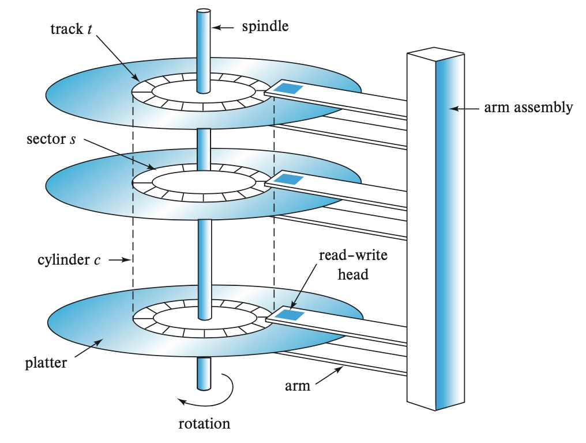
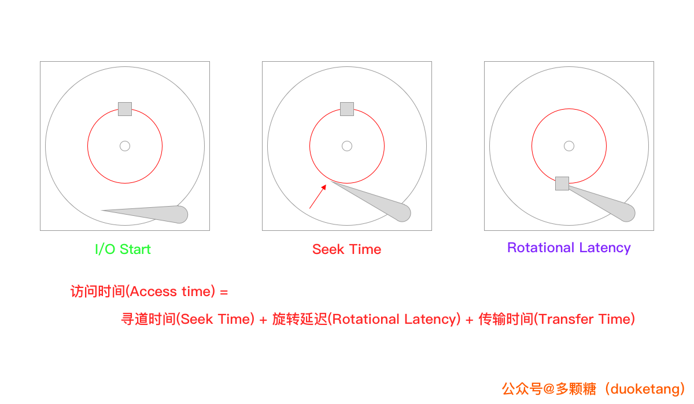
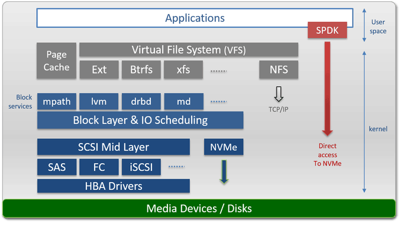
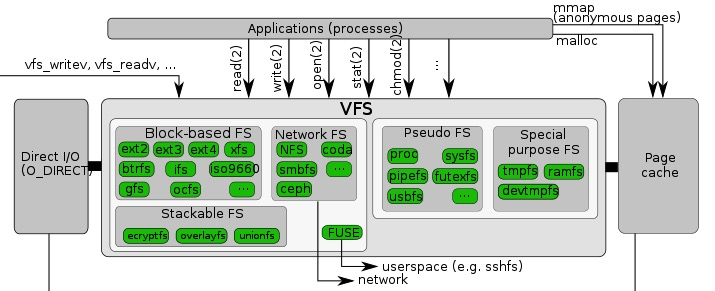
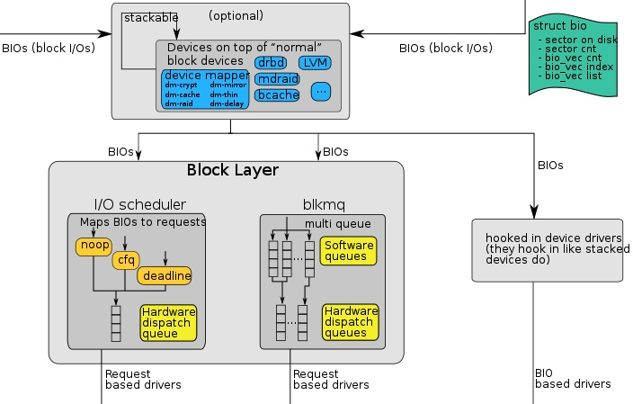
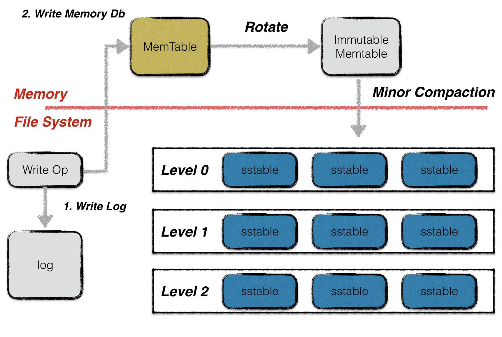

<!-- migrated-from: https://tangwz.com/posts/202011-disk/ -->

数据库系统总会涉及非易失性存储，我们需要知道一个典型的计算机系统是如何进行存储管理的。时至今日，虽然 SSD 已经成为很多数据库管理员的选择，但传统 HDD 还是有着广泛的应用，文件系统和存储引擎大部分设计和发展还是基于 HDD 的行为；过去数十年来，HDD 一直是计算机系统中持久存储的主要形式。

本文回顾硬盘的物理特性，硬盘的主要性能指标，以及操作是如何进行硬盘 I/O 性能优化的，最后参考开源系统来讨论如何根据硬盘特性进行系统设计。

## 硬盘的物理特性

硬盘（Hard Disk Drive，HDD，有时为了与固态硬盘相区分称“机械硬盘”）是计算机最基础的**非易失性存储**，它在平整的磁性表面存储和检索数据，数据通过离磁性表面很近的磁头由电磁流来**改变极性的方式**被写入到磁盘上。数据可以通过盘片被读取，原理是磁头经过盘片的上方时盘片本身的磁场导致读取线圈中电气信号改变[^1]。

硬盘主要包括一至数片高速转动的盘片(platter)以及放在传动手臂上的读写磁头(read–write head)，每个盘片都有两面，都可记录信息，因此也会相对应每个盘片有 2 个磁头。物理结构如下图所示：

我们通常更关注硬盘内部的结构：

_——图源自《数据库系统概念》_

- **磁道（Track）**：当硬盘旋转时，磁头若保持在一个位置上，则每个磁头都会在磁盘表面划出一个圆形轨迹，这些圆形轨迹就叫做磁道；
- **柱面（Cylinder）**：在有多个盘片构成的盘组中，由不同盘片的面，但处于同一半径圆的多个磁道组成的一个圆柱面；
- **扇区（Sector）**：磁盘上的每个磁道被等分为若干个弧段，这些弧段便是硬盘的扇区（Sector）。硬盘的第一个扇区，叫做[引导扇区](https://en.wikipedia.org/wiki/Boot_sector)；

## 硬盘性能的度量

硬盘常规的一次 I/O 需要 3 步，每一步都有相关的延迟，可以将 I/O 访问时间（access time）表示为 3 部分之和：

- 寻道时间（seek time）：将读写磁头组合定位在访问块所在磁道的柱面上所需要的时间
- 旋转延迟（rotational latency）：等待访问块的第一个扇区旋转到磁头下的时间；
- 传输时间（transfer time）：完成数据传输需要的时间，取决于硬盘数据传输率；

为了更好理解寻道时间和旋转延迟，可以参考下图：

值得一提的是，硬盘的趋势是传输速率相当快，因为硬盘制造商擅长将更多位填塞到同一表面。但驱动器的机械方面与寻道相关（传动手臂速度和旋转速度），改善相当缓慢[^2]。因此，为了摊销 I/O 成本，**必须在寻道之间传输尽可能多的数据**。

## 操作系统中的硬盘

就像进程是 CPU 的抽象、地址空间是内存的抽象一样，存储在操作系统的抽象是文件（目录也是一种文件）。

如果算上内核中的文件系统、驱动等，Linux 的存储架构大体如下：

一个具体的读流程[^3]：

1.  系统调用 `read（）` 会触发相应的 VFS（Virtual Filesystem Switch）函数，传递参数有文件描述符和文件偏移量；
2.  VFS 确定请求的数据是否已经在内存缓存中；若数据不在内存中，内核需要通过块设备层从物理设备上读取数据；
3.  通过通用块设备层（Generic Block Layer）在块设备上执行读操作，启动I/O 操作，传输请求的数据；
4.  在通用块设备层之下是 I/O 调度（I/O Scheduler），根据内核的调度策略，将对应的 I/O 插入队列；
5.  最后，块设备驱动（Block Device Driver）通过向磁盘控制器发送相应的命令，执行真正的数据传输；

我们从上到下来看一些关键的点。

### VFS（Virtual File Systems）

VFS 为多种不同的文件系统提供一个通用的接口，通常包含四个部分：

- Superblock：包含关于特定文件系统的信息，例如文件系统中有多少个 Inode 和数据块、Inode 表的开始位置等等；
- Inode(Index node)：描述文件的元数据的结构，包括：文件类型（例如，常规文件、目录等）、大小、权限、一些时间信息、分配给它的块数，以及有关其数据块驻留在磁盘上的位置的信息；
- Dentry(Directory Entries)：目录。VFS 是以完整的路径名作为参数，需要遍历路径的目录读取 Inode 信息，一般放到内存中；
- File：进程打开的文件；

这里我们不讨论这些数据结构是如何具体实现的，我们重点关注操作系统如何对读写 I/O 进行优化的，这些优化常常启发人们后续的软件设计。

### Page Cache

> Linux 2.2版本之前内核同时有 `Page Cache` 和 `Buffer Cache` 两个 cache，到了 2.4 版本后这两个 cache 被合在了一起，现在内核只有 `Page Cache`[^4]

倘若没有任何缓存的情况下：

- 对于打开文件，每次都需要对目录层次结构中的每个级别至少进行两次读取（一次读取相关目录的 inode，并且至少有一次读取其数据）。
- 我们要创建一个新的文件，至少需的 I/O 有：一次查找空闲的 inode，一次写入 inode 的存储（将其标记为已分配），一次写入新的 inode 本身（初始化它），一次写入目录的数据，一次读写目录的 inode 以便更新它，最后一次写入真正的数据块——**所有这些只是为了创建一个文件！**[^5]

Page Cache 位于 VFS 和文件系统之间[^6]，在内存中保存常用的块，如果所需的页面已经存在，则根本不需要调用文件系统代码。第一次打开可能会产生很多 I/O 来读取目录的 inode 和数据，但是根据局部性原理，大部分时候会命中缓存。

如果写入数据，则首先将其写入 Page Cache，然后作为脏页（dirty pages）进行管理，这些脏页会定期（也会与系统调用 `sync` 或 `fsync` 一起）传输到存储设备。这里也常被称为写缓冲（write buffering），主要有以下三个好处：

- 通过延迟写入，将许多小的 I/O 成批写入到磁盘；
- 通过将一些写入缓存在内存中，系统可以调度后续的 I/O，从而提高性能；
- 一些写入可以通过拖延来完全避免。例如，如果应用程序创建文件并将其删除，则可以通过延迟写入完全避免写入磁盘。

> 有些系统（如数据库）不喜欢这种折中，因此，为了避免由于写入缓冲导致的意外数据丢失，它们就强制写入磁盘，通过调用 `fsync()`，使用绕过缓存的直接 I/O（direct I/O） 接口，或者使用原始磁盘（raw disk）接口完全避免使用文件系统。

### 通用块层（Generic Block layer）

对于 VFS 来说，块（block）是基本的数据传输单元；但对于块设备（硬盘也是块设备中的一种）来说，扇区是最小寻址单元，块设备无法对比扇区还小的单元进行寻址和操作。通用块设备层（Generic Block Layer）就是这一转换的中间层，也是内核的一个组成部分，它处理系统所有对块设备的请求。有通用块设备层后，内核可以方便地：

- 为所有的块设备管理提供一个抽象视图，隐藏硬件块设备的差异性；
- 提供不同的 I/O 调度策略，能够优化性能，减少磁头移动次数，减少磁盘擦写次数，延长磁盘寿命；

扇区大小是设备的物理属性，一般大小是 512 字节。由于扇区是块设备的最小可寻址单元，所以块不能比扇区还小，只能整数倍于扇区大小，一般是 4K。

但是，在更新磁盘时，驱动器制造商唯一保证的是单个 512 字节的写入是原子的（具体情况参见制造商说明书）。因此，如果发生不合时宜的掉电，则可能只完成部分写入。

### 块设备驱动层（Block Device Driver）

I/O 调度后的请求会交给相应的设备驱动程序去进行读写，驱动层中的驱动程序对应具体的物理存储设备，向控制器发出具体的指令来读写数据。由于不是做驱动开发，这里不是我们关注的重点。

## 常见的硬盘 I/O 优化

通过上面的分析，我们知道 Linux 一次读写请求到达磁盘的过程，为了降低文件系统的 I/O 成本，Linux 主要：

- 通过缓存来提高读写性能，本质就是减少磁盘寻道次数；
- 同时根据磁盘顺序读写快、随机读写慢的特点，尽量做追加写；

这些设计思想也被许多开源软件广泛采用。

### 追加写

Google BigTable [^7]的论文把 LSM-Tree（Log Structured-Merge Tree）[^8] 这个古老的数据结构带回前沿，基于 LSM-Tree 的存储引擎有：Leveldb、Rocksdb、HBase、Cassandra 等等。不同于传统的 B 树类存储引擎，基于 LSM-Tree 的存储引擎尤其适合写多读少的场景。

当一个写请求到达时，它会被写到 memtable 中，memtable 在内存里维护一个平衡二叉树或者跳表来保持 key 有序（memtable 同时会写 WAL 来备份数据到磁盘，以便崩溃恢复），当 memtable 达到既定规模时，就会转换为 immutable memtable（不可变 memtable，顾名思义，只读的），然后后台进程会将 immutable memtable 压缩成 SSTable(Sorted String Table，即有序的) 写到磁盘。

存储引擎只做了顺序磁盘读写，因为没有文件被编辑，增加、修改或删除操作都用简单的生成新的文件来存储。旧的文件不会被更新，重复的记录只会通过创建新的纪录来覆盖，这当然也就产生了一些冗余的数据。显然随着数据的不断修改，SSTable 的文件数量会不断的增加，

所以，系统会定期的执行合并（compaction)操作，即把多个 SSTable 归并为一个大的 SSTable，移除重复的更新或者删除纪录，同时也会删除上述的冗余。通过这样的方式减少了文件个数的增长，保证读操作的性能。因为 SSTable 文件都是有序结构的，所以合并操作也是非常高效的。

当然 LSM-Tree 实现还有很多具体的细节，例如：快照、SSTable 索引、如何组织合并后的 SSTable 等内容，这里我们暂且不表，后面我们会专注于分析 LSM-Tree 的具体实现（leveldb、rocksdb）。

总之，LSM-Tree 充分利用了**内存随机读写 + 顺序落盘 + 定期归并**来获取最大性能。

### 较大的文件

硬盘最适合顺序的大文件 I/O 读写，在硬盘上分散的多个小文件会损害性能；同时，元数据过多也会带来很多 I/O 开销（请求很多次 inode）影响性能，所以我们尽量：

- 将小文件合并为大文件
- 优化元数据存储和管理

Google File System[^9] 和 Facebook Haystack[^10] 是两个典型的案例：

- GFS 选择了当时看来相当大的 64M 作为数据存储的基本单位，就是为了减少大量元数据；
- Facebook Haystack 同样将小文件集合成大文件来减少了元数据数目；同时精简元数据，去掉一切 Facebook 场景中不需要的元数据，压缩元信息到足够小并全部加载到内存中，避免请求 inode 带来的开销。

## Reference

[^1]: [https://en.wikipedia.org/wiki/Disk_storage](https://en.wikipedia.org/wiki/Disk_storage)

[^2]: “[Hardware Technology Trends and Database Opportunities](https://people.eecs.berkeley.edu/~pattrsn/talks/sigmod98-keynote-color.pdf)” David A.PattersonKeynote Lecture at the ACM SIGMOD Conference (SIGMOD ’98) June, 1998

[^3]: [https://www.ilinuxkernel.com/files/Linux.Generic.Block.Layer.pdf](https://www.ilinuxkernel.com/files/Linux.Generic.Block.Layer.pdf)

[^4]: [https://books.google.de/books?id=lZpW6xmXrzoC&pg=PA348&dq=linux+buffer+cache+page+cache&cd=1#v=onepage&q=linux%20buffer%20cache%20page%20cache&f=false](https://books.google.de/books?id=lZpW6xmXrzoC&pg=PA348&dq=linux+buffer+cache+page+cache&cd=1#v=onepage&q=linux%20buffer%20cache%20page%20cache&f=false)

[^5]: “[Operating Systems: Three Easy Pieces](http://pages.cs.wisc.edu/~remzi/OSTEP/file-implementation.pdf)” Peter Reiher

[^6]: “[The future of the page cache](https://lwn.net/Articles/712467/)”

[^7]: “[Bigtable:A distributed storage system for structured data](https://static.googleusercontent.com/media/research.google.com/zh-CN//archive/bigtable-osdi06.pdf)” Chang F;Dean J;Ghemawat S;Hsieh WC,Wallach DA,Burrows M,Chandra T,Fikes A,Gruber RE, 2006

[^8]: Patrick O’Neil, Edward Cheng, Dieter Gawlick, and Elizabeth O’Neil, [The Log-Structured Merge-Tree](https://www.cs.umb.edu/~poneil/lsmtree.pdf). Acta Informatica 33, June 1996.

[^9]: Ghemawat, S., Gobioff, H., and Leung, S.-T. 2003. [The Google file system](https://static.googleusercontent.com/media/research.google.com/zh-CN//archive/gfs-sosp2003.pdf) In 19th Symposium on Operating Systems Principles. Lake George, NY. 29-43.

[^10]: Beaver D, Kumar S, Li HC, Sobel J, Vajgel P et al (2010) Finding a needle in [haystack: facebook’s photo storage](https://www.usenix.org/legacy/event/osdi10/tech/full_papers/Beaver.pdf). In OSDI, vol 10. pp 1–8
