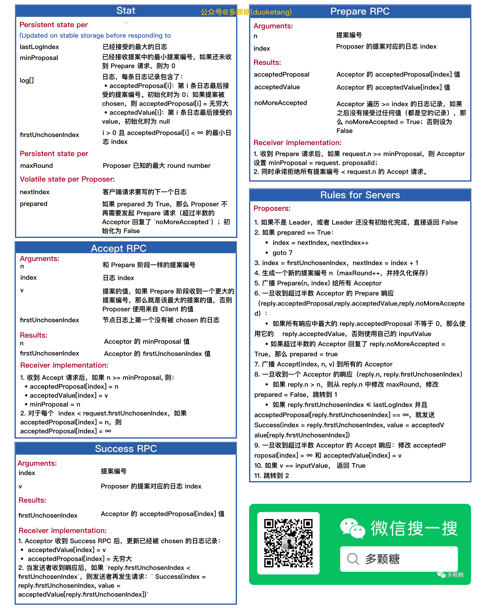
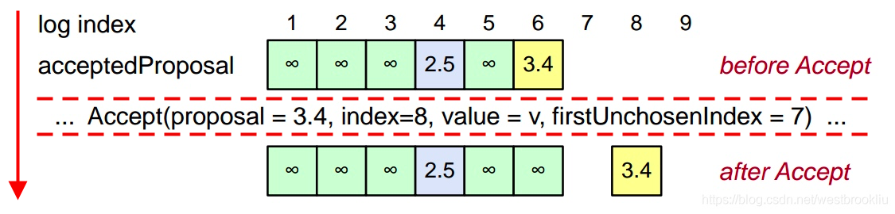

<!-- migrated-from: https://tangwz.com/posts/202011-understanding-multi-paxos/ -->

Multi-Paxos 在文献中并没有准确的实现细节，这里提供一个相对完整的规范，保持接近 Leslie Lamport 在 “[The Part-Time Parliament.](https://lamport.azurewebsites.net/pubs/lamport-paxos.pdf)” 中给出的算法。

**这里描述的 Multi-Paxos 尚未经过实践证明其正确性**。

**众所周知 Raft 是更易理解的，所以我参照 Raft 的风格，将 Paxos 转换成了下图。**

# 1\. 基础

*   提案编号 _n_ = (round number, server ID)
*   _T_： 固定的超时时间，用于选举算法
*   _α_：并发限制，用于配置变更

## 1.1 Leader 选举算法

*   每个节点每隔 T（ms） 向其它服务器发送心跳
*   如果一个节点在 2（Tms） 时间内没有收到比自己 server ID 更大的心跳，那它自己就转为 Leader

# 2\. 持久化

## 2.1 Acceptor 上的持久化状态

*   _lastLogIndex_：已经接受的最大的日志index
*   _minProposal_：已经接收提案中的最小提案编号，如果还未收到 Prepare 请求，则为 0

每个 Acceptor 上还会存储一个日志，日志索引 i ∈ \[1, lastLogIndex\]，每条日志记录包含以下内容：

*   _acceptedProposal\[i\]_：第 i 条日志最后接受的提案编号。初始化时为 0；如果提案被 chosen，则 acceptedProposal\[i\] = 无穷大
*   _acceptedValue\[i\]_：第 i 条日志最后接受的 value，初始化时为 `null`
*   _firstUnchosenIndex_：i > 0 且 acceptedProposal\[i\] < ∞ 的最小日志 index

## 2.2 Proposer 上的持久化状态

*   _maxRound_：Proposer 已知的最大 round number

## 2.3 Proposer 上的易失性状态

*   _nextIndex_：客户端请求要写的下一个日志 index
*   _prepared_：如果 prepared 为 True，那么 Proposer 不再需要发起 Prepare 请求（超过半数的 Acceptor 回复了 `noMoreAccepted`）；初始化为 False

# 3 流程

## 3.1 Prepare（阶段 1）

## 请求：

*   _n_：提案编号
*   _index_：Proposer 的提案对应的日志 index

### 接受者处理：

收到 Prepare 请求后，如果 `request.n >= minProposal`，则 Acceptor 设置 `minProposal = request. proposalId`；同时承诺拒绝所有提案编号 < request.n 的 Accept 请求。

### 响应：

*   _acceptedProposal：Acceptor_ 的 `acceptedProposal[index]`
*   _acceptedValue_：Acceptor 的 `acceptedValue[index]`
*   _noMoreAccepted_：Acceptor 遍历 >= index 的日志记录，如果之后没有接受过任何值（都是空的记录），那么 noMoreAccepted = True；否则设为 False

## 3.2 Accept（阶段 2）

### 请求：

*   _n_：和 Prepare 阶段一样的提案编号
*   _index_：日志 index
*   _v_：提案的值，如果 Prepare 阶段收到一个更大的提案编号，那么就是该最大的提案的值，否则 Proposer 使用来自 Client 的值
*   _firstUnchosenIndex_：节点日志上第一个没有被 chosen 的日志 index

### 接受者处理：

收到 Accept 请求后，如果 `n >= minProposal,` 则：

*   `acceptedProposal[index] = n`
*   `acceptedValue[index] = v`
*   minProposal = n 对于每个 `index < request.firstUnchosenIndex`，如果 `acceptedProposal[index] = n`，则 `acceptedProposal[index] = ∞`

### 响应：

*   _n_：Acceptor 的 minProposal 值
*   _firstUnchosenIndex_：Acceptor 的 firstUnchosenIndex 值

## 3.3 Success（阶段 3）

### 请求：

*   _index_：日志的索引
*   _v_：log\[index\] 已 chosen 的提案值

### 接受者处理：

Acceptor 收到 Success RPC 后，更新已经被 chosen 的日志记录：

*   acceptedValue\[index\] = v
*   acceptedProposal\[index\] = 无穷大

### 响应：

*   _firstUnchosenIndex_：Acceptor 的 firstUnchosenIndex 值

当发送者收到响应后，如果 `reply.firstUnchosenIndex < firstUnchosenIndex`，则发送者再发生请求： `Success(index = reply.firstUnchosenIndex, value = acceptedValue[reply.firstUnchosenIndex])`

## 3.4 Proposer 算法：`write(inputValue) → bool`

1.  如果不是 Leader，或者 Leader 还没有初始化完成，直接返回 False
2.  如果 prepared == True：
    *   index = nextIndex, nextIndex++
    *   goto 7
3.  index = firstUnchosenIndex，nextIndex = index + 1
4.  生成一个新的提案编号 n（maxRound++，并持久化保存）
5.  广播 `Prepare(n, index)` 给所有 Acceptor
6.  一旦收到超过半数 Acceptor 的 Prepare 响应（`reply.acceptedProposal,reply.acceptedValue,reply.noMoreAccepted`）：
    *   如果所有响应中最大的 `reply.acceptedProposal` 不等于 0，那么使用它的 `reply.acceptedValue`，否则使用自己的 `inputValue`
    *   如果超过半数的 Acceptor 回复了 `reply.noMoreAccepted = True`，那么 `prepared = true`
7.  广播 `Accept(index, n, v)` 到所有的 Acceptor
8.  一旦收到一个 Acceptor 的响应（`reply.n, reply.firstUnchosenIndex`）
    *   如果 `reply.n > n`，则从 `reply.n` 中修改 `maxRound`，修改 `prepared = False`，**跳转到 1**
    *   如果 `reply.firstUnchosenIndex ≤ lastLogIndex` 并且 `acceptedProposal[reply.firstUnchosenIndex] == ∞`，就发送 `Success(index = reply.firstUnchosenIndex, value = acceptedV alue[reply.firstUnchosenIndex])`
9.  一旦收到超过半数 Acceptor 的 Accept 响应：修改 `acceptedP roposal[index] = ∞` 和 `acceptedValue[index] = v`
10.  如果 `v == inputValue`， 返回 True
11.  **跳转到 2**

# 4\. 配置变更（成员变更）

*   配置通常一个列表，每一项存着一台服务器的 id 和 ip 地址，作为一条特殊的记录存储在日志中
*   `𝛼` 表示配置多少条记录后才能生效。第 `i` 条记录 chosen 时的配置存储在第 `i-𝛼` 条或 `i-𝛼` 条之前
*   `α` 用作并发限制：在 `i` 这个位置的值被 chosen 之前，我们不能 chosen `i+α` 这个位置的值
