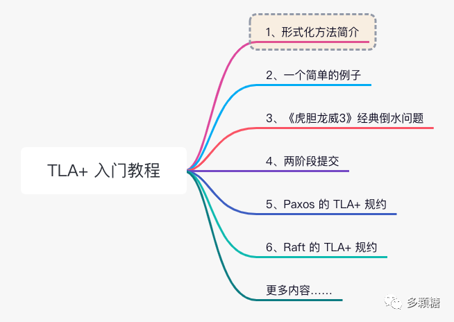
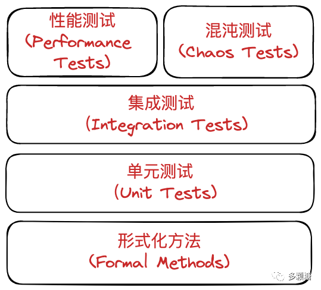
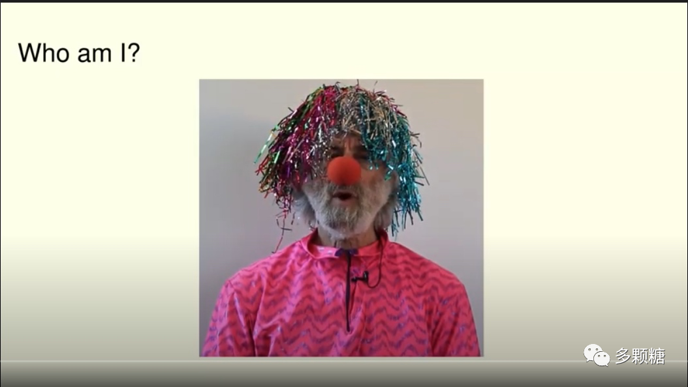
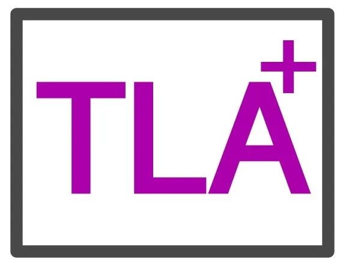
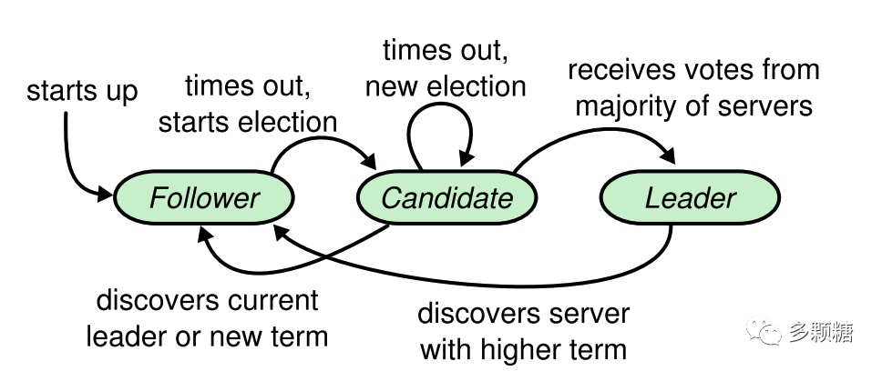
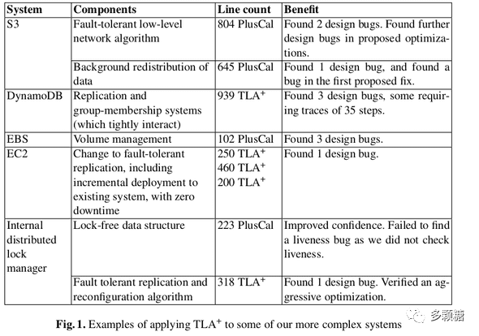

<!-- migrated-from: https://tangwz.com/posts/202207-tla-1/ -->

_本次 TLA+ 入门教程系列将分为几个部分，帮助你从零掌握 TLA+ 语言的基本知识，欢迎关注公众号和知乎“多颗糖”。_

## 前言

1960 年代中后期，软件行业开始爆发“软件危机（Software Crisis）”[^1]。所谓“软件危机”，是指在软件开发及维护的过程中所遇到的一系列严重问题，这些问题皆可能导致软件寿命缩短、甚至夭折。随着急速增长的算力和软件越来越复杂，软件开发成为一项难以管理、高风险、高失败率的活动。从本质上来说，软件危机还意味着**写出正确、可理解、可验证的程序十分困难**。

> 软体危机的主要原因，很不客气地说：在没有机器的时候，编程根本不是问题；当我们有了电脑，编程开始变成问题；而现在我们有巨大的电脑，编程就成为了一个同样巨大的问题。—— Edsger Dijkstra [^2]

针对“软件危机”，人们提出了种种解决方案，归纳起来基本有两类：

*   1、采用工程方法来组织、管理软件的开发过程；
*   2、深入探讨程序和程序开发过程的规律，建立严密的理论，推演和验证理论的正确性，用来指导软件开发实践。

前者即“软件工程”，而后者则是本文要讨论的“形式化方法”。

对于任何一个软件，正确性永远摆在第一位。但是，一般来说，软件的正确性难以证明，软件通常会经过层层测试，却依然无法避免错误发生。

按照我们以往开发软件的经验，首先会先弄个系统设计文档（有时候甚至没有），然后照着需求、流程图或消息结构体等材料开始写代码，最后进行大量的测试去验证功能是否正确。这种情况下往往考验的是经验，因此越有经验的人往往能想到比较多的细节和可能性，设计出来的系统通常越稳定。这当然也取得了一些效果，尤其是业务软件开发，大部分都维持着这样的流程。

但是对于并发和分布式系统等基础软件，往往具备很高的复杂度，其行为、状态的可能性太多，难以复现，正确性也更难以验证和测试。

包括图灵奖得主 Leslie Lamport 在内的多个计算机科学家都认为，采用形式化方法（Formal Methods）对系统进行形式化验证和分析，是构建正确、可靠和安全的软件的一个重要途径。

形式化方法，就是采用数学与逻辑的方法描述和验证系统，包括对系统行为和性质进行描述和验证，可以用一种或多种语言来描述，例如一阶逻辑、高阶逻辑、时态逻辑、状态机、代数、Pi 演算、特殊的程序语言等等。在并发和分布式系统领域，最常用的是由 Leslie Lamport 提出的行为时序逻辑 TLA+ 语言。

_大佬为了让你学习 TLA+，还扮成了小丑_

Leslie Lamport 在并发和分布式系统领域做出开创性贡献，并因此获得图灵奖，我想大家对这位老爷子并不陌生。Lamport 自称是一个理论家(theoretician)，但他理解工程师构建真实系统的需求，因此他自己的研究也是以实用为目标，其中 Paxos 最为著名。

## 1、什么是 TLA+

用 Lamport 自己的话来说，**TLA+ 是一种用于数字系统(digital systems)高级(high-level)建模的语言**，并且有相应的工具对模型进行检验。

这里的关键词是数字系统和 high-level，数字系统包括算法、程序和各种软硬件在内的系统，high-level 意味着是在代码级别之上，位于设计级别进行思考。

> TLA+ 按照官方文档[^3]，应该写作 $TLA^+$，即 + 号在 TLA 的右上方，但是这给网页排版造成了一定困难，因此常常写为 TLA+ 即可。

TLA+ 将一个系统抽象为一系列离散的事件，我们熟知的第一个数字系统是时钟，它以离散的滴答声模拟时钟；计算机也是数字系统，由一系列离散的程序步骤组成。TLA+ 将离散的事件描述为状态变化，系统中的变量会因为事件从一个状态变为另一个状态——这就是状态机模型。

为什么要通过状态机的方法来抽象呢？因为绝大多数时候，我们的程序和算法是长期运行的，对于这种一直运行的程序，通过状态机来抽象是一种有效的方式。再加上，状态机在分布式系统有着广泛的应用（例如，RSM），TLA+ 正好是用来描述并发和分布式系统全局状态转换的最佳语言。

如果我们把系统中的一个状态描述为一个变量，那么状态机可以被描述为：

0.  系统所有的**变量**
1.  这些变量的**初始值**是什么
2.  哪些**动作**让变量的状态发生改变，这些变量在当前状态下的值与它们在下一个状态下的可能值之间的关系

即，TLA+ 主要描述系统状态的转变关系。记住这个描述方法，我们会按照此方法来编写和阅读所有的 TLA+ 程序。

TLA+ 如此有用的另一个关键点是，TLA+ 有一个被称为 TLC 的模型检验工具，你可以认为这是 TLA+ 语言的 IDE，其功能简单来说，就是遍历 TLA+ 抽象出来的系统的每一个可能路径，并在每条可能的路径上对一些条件（称为“不变式”）进行检验。为了使 TLC 正确遍历所有可能的路径并进行有效的检验，我们需要告诉它应该去检验什么条件和属性。

因此，编写 TLA+ 语言的关键就是，抽象系统的变量，描述变量的初始值，变量的转变关系，以及对每个关键路径进行校验。我们可以按照前面描述状态机的 0、1、2 三个步骤来编写 TLA+ 描述，然后进行校验，最后通过模型检验工具进行验证。

本节作为这一系列的开篇，先不展开介绍具体的语法和工具箱使用方法，这部分内容将在下一节学习。

> 为了推广 TLA+ 语言，Lamport 还发明了更为接近编程语言的 PlusCal 语言，PlusCal 不能直接运行，而是转译为 TLA+ 语言后再运行。为了不给读者增加更多心智负担，本系列不讨论 PlusCal 语言。

## 2、TLA+ 真的有用吗？

最后，Lamport 自己也多次强调，TLA+ 始终不是可以实际运行的生产代码，主要是针对系统中关键部分进行建模并验证，让你从设计层面上就能提前发现问题。

可见，TLA+ 并非银弹，不仅需要使用者的基础数学、抽象思维和思考能力，并且与实际代码尚有一定距离。

许多工程师会因此产生质疑，直觉上认为这个东西投入产出效益低，平常写代码说不定连文档和单元测试都没时间写，还要额外写一个 TLA+ 去单纯验证系统，真的值得吗？

笔者觉得这样的质疑是合理的，毕竟绩效考核都看最终产出，在国内大厂你甚至没有时间去弄这玩意。不过根据笔者的观察，现在国内基础软件创业公司越来越多，TLA+ 的使用也多了起来，笔者找到的有：TiDB[^4]、TDengine[^5]、KingbaseES[^6] 等企业。

面对这些质疑，Lamport 也找了他在 Intel、Amazon 的熟人，了解他们对于 TLA+ 的使用情况[^7]。实际上 TLA+ 在学术界和工业界都有牛逼的人物和厂商背书，据统计，国外使用 TLA+ 的经典案例有：

*   Intel 将 TLA+ 用于工业硬件建模，帮助工程师在实际构建之前进行思考；
*   AWS 从 2011 年开始使用 TLA+，TLA+ 模型检查在 DynamoDB，S3，EBS 和内部分布式锁管理器中均检测出了难以发现的潜在错误，AWS 已经发表了数篇形式化方法的论文;
*   Microsoft 在 Xbox 360，Azure 中都有使用 TLA+，还使用 TLA+ 设计了 Cosmos DB[^8]；
*   一款以网络为中心的 RTOS 应用案例；
*   对各种分布式共识算法（Paxos、Raft 和 EPaxos 等）都提供其 TLA+ 验证；

可见，软件形式化方法经过几十年的研究、推广和应用，取得了大量重要成果，形式化方法不仅仅停留在学术界，已经逐渐融入软件开发过程的各个阶段，从需求分析、功能描述（规约）、体系结构、算法设计、编程、测试甚至运维阶段。

所以，即使你不打算使用 TLA+ 来写点什么，学习 TLA+ 依然有价值，不仅能够让你快速理解别人的算法，还能提供一种新的思考方式，至少在分布式领域，能让你成为一个更好的工程师。

况且，TLA+ 并不难学习，Amazon 分享的案例显示[^9]，不论是老鸟还是新手，都能在几周内上手 TLA+，是非常值得投资的技术。

笔者相信，跟着本次 TLA+ 系列，你甚至不需要几周时间，就可以入门 TLA+，从而帮助你对系统行为进行清晰思考（科学视角），看懂 Paxos 和 Raft 算法的 TLA+ 描述，验证分布式协议的正确性。

下一节，让我们从一个最简单的例子开始。

## 参考引用

[^1]: 软件危机（Software Crisis）：https://en.wikipedia.org/wiki/Software\_crisis

[^2]: Dijkstra, E. W. The Humble Programmer. Communications of the ACM. Aug 1972, 15 (10): 859–866. doi:10.1145/355604.361591.

[^3]: TLA+ 官方主页：https://lamport.azurewebsites.net/tla/tla.html

[^4]: TiDB TLA+ 规约：https://github.com/pingcap/tla-plus

[^5]: TDengine 中有使用 Raft 的 TLA+ 规约：https://www.taosdata.com/techtalk/8976.html

[^6]: KingbaseES 使用TLA+和PlusCal增强产品的可靠性：https://bbs.kingbase.com.cn/thread-753-1-1.html

[^7]: Industrial Use of TLA+： [https://lamport.azurewebsites.net/tla/industrial-use.html](https://lamport.azurewebsites.net/tla/industrial-use.html)

[^8]: High-level TLA+ specifications for the five consistency levels offered by Azure Cosmos DB：https://github.com/Azure/azure-cosmos-tla

[^9]: How Amazon Web Services Uses Formal Methods, Chris Newcombe, Tim Rath, Fan Zhang, Bogdan
