<!-- migrated-from: https://tangwz.com/posts/202207-tla-2/ -->

_本次 TLA+ 入门教程系列将分为几个部分，帮助你从零掌握 TLA+ 语言的基本知识，欢迎关注公众号和知乎“多颗糖”。_

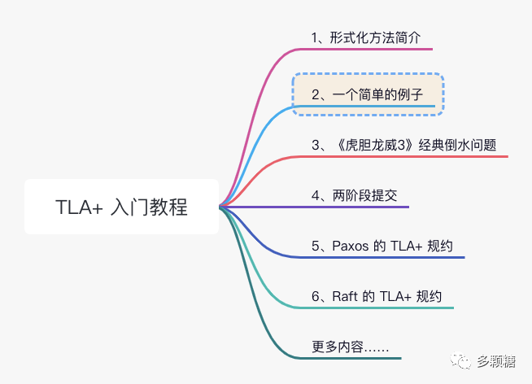

## 1、形式化方法

上一节我们介绍了形式化方法和 TLA+，**Get Your Hands Dirty**！让我们小试牛刀，动动手，用 TLA+ 语言对一个简单的程序进行抽象。以下示例来自 Lamport 亲自出的教程[^1]。

首先，我们有以下简单 C 程序，`someNumber()` 函数返回一个 0 到 1000 中的随机值，然后对变量 `i` 自增 +1。

```c
int i;
void main() {
  // someNumber() 返回 0 到 1000 中的一个数字
  i = someNumber();
  i = i + 1;
}
```

上一节我们介绍了，TLA+ 通常按照状态机进行抽象，我们可以按照以下步骤进行抽象：

0.  首先是变量，很显然，这段代码只有一个变量 `i`。
1.  接着是初始值，也很明显，`i` 的初始值为 0。
2.  下一个状态的转换关系（也称为“**次态关系**”）。问题是 `i` 的下一个状态是什么呢？

我们假设某次运行程序时 `someNumber()` 返回 42，那么状态变换就是 `[i : 0] → [i : 42] → [i : 43]`，对于 `i = 42`，`i` 的下一个状态是 `i = 43`。接下来，程序结束，`i` 就没有下一个状态了。

但假设另一种情况， `someNumber()` 返回 43，那么 `i` 的下一个状态是 `i = 44`，和上面的情况冲突，我们得到了不一样的次态关系。

对于同样的状态 `i = 43`，下一个状态却有两种不同的可能，我们没法找到一个固定的次态关系。显然，这样建模是行不通的。

虽然这一代码逻辑非常简单，但抽象为状态机模型却有违我们平常写代码的逻辑。这里的问题在于，我们缺少了对程序控制的抽象，导致我们无法判断 `i` 的下一个状态是什么。因此，我们需要增加一个变量 `pc` 来代表控制流状态。还是如上代码，我们定义 `pc` 的值如下：

```c
int i;
void main() {
  i = someNumber(); // pc = "start"
  i = i + 1;        // pc = "middle"
}                   // pc = "done"
```

那么，增加程序控制的变量 `pc` 后，我们再次抽象为：

0.  变量： `i` 和 `pc`。
1.  初始值是 `i = 0` and `pc = "start"`。
2.  次态关系我们用伪代码表示，如下：

```
if current value of pc equals "start"
    then next value of i in {0,1,...,1000}
         next value of pc equals "middle"
    else if current value of pc equals "middle"
        then next value of i equals current value of i + 1
             next value of pc equals "done"
        else no next values
```

翻译过来就是：当 `pc = "start"` 时，`i` 的下一个状态是 0 到 1000 的随机值，`pc` 的下一个状态是 “middle”；当 `pc = "middle"` 时，`i` 的下一个状态 `i + 1`，`pc` 的下一个状态是 “done”；之后结束，没有下一个状态。

但是这样写的缺点是不够简洁，也不够数学。TLA+ 就是用来描述这类状态机模型的语言。

我们使用 TLA+ 语言一步步重写上面的伪代码。首先，`pc` 就意味着 current value of pc（即，`pc` 的当前状态）这里类似冗余的句子可以删去：

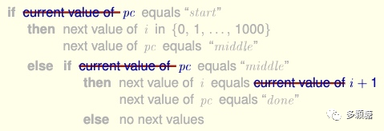

接着，TLA+ 使用 `pc'` 表示 next value of pc（即，`pc` 的下一个状态），使用 `i'` 表示 next value of i，那么又可以简化为：

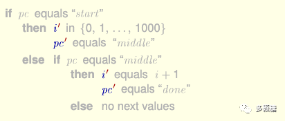

然后，我们用 = 来表示 equals，用集合符号 $\\in$ 来表示 `i in {0,1,...,1000}`，同时将 `{0,1,...,1000}` 简写为 `0..1000`。我们得到：

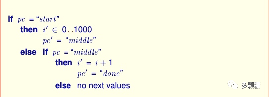

这样看起来简洁一些了，但还不够。我们可以用 and 把 `i` 和 `pc` 的下一个状态连接起来（即，集合中的“与”），同时使用 /\\ 符号来表示 and 关系。可以得到：

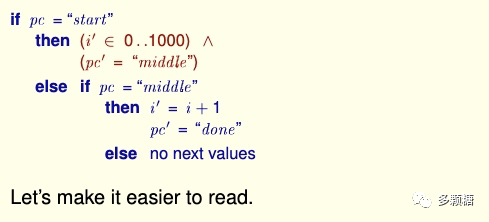

最后，no next values 我们直接表示为 `FALSE` 即可，所以有：

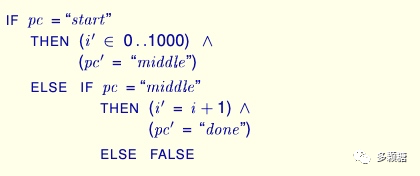

注意，以上代码是以 PDF 格式显示的，但是 TLA+ 源代码是 ASCII 码，其中并没有一些特殊数学符号，所以如果编写 TLA+ 的时候，用 /\\ 和 / 来代替关系“与”和“或”，用 \\in 来代替包含关系，写为：

```tla+
IF pc = "start"
    THEN (i' \in 0..1000) /\
         (pc' = "middle")
    ELSE IF pc = "middle"
        THEN (i' = i+1) /\
             (pc' = "done")
    ELSE FALSE
```

> 经常写数学公式的同学会发现，这里的语法其实和 LaTeX 是一样的，因为它们都是 Lamport 发明的。

现在，我们进一步分析和化简上面的代码。仔细观察，上面的条件判断语句其实可以再简化为：

```
    (   pc = "start"
     /\ i' \in 0..1000
     /\ pc' = "middle")
\/  (   pc = “middle”
     /\ i' = i + 1
     /\ pc' = "done")
```

如果你也是个熟练的 if else 工程师，我想你应该能理解为什么可以写成以上形式，这就是一些布尔条件的化简和位置互换。

我们还可以再进行简写，为了排版美观，我们可以去掉括号，改为在空缺的语句（即第一行的第一列）前面补上同样缩进位置的布尔符号。那么，上面的式子写为：

```
\/   /\ pc = "start"
     /\ i' \in 0..1000
     /\ pc' = "middle"
\/   /\ pc = “middle”
     /\ i' = i + 1
     /\ pc' = "done"
```

这样，我们就去掉了括号得到了上面的式子。注意，这里只是我们状态机的最后一部分，即次态关系。我们还要补全状态机的前面部分。完整的 TLA+ 程序如下：

```
--------------------------- MODULE SimpleProgram ---------------------------
EXTENDS Integers
VARIABLES i, pc

Init == (pc = "start") /\ (i = 0)

Pick == \/ /\ pc = "start"
           /\ i' \in 0..1000
           /\ pc' = "middle"

Add1 == \/ /\ pc = "middle"
           /\ i' = i + 1
           /\ pc' = "done"

Next == Pick \/ Add1

=============================================================================
```

至此，读者想必能够大致理解这行代码想要表述的内容，只需要再补充一些前面没涉及到的内容。让我们从头看一下。

首先是开头和结尾，每个 TLA+ 程序都包裹在 MODULE xxx 这个块中，这是一个固定格式。当你通过 TLA+ 工具箱创建一个新的规约，开头和结尾这个框应该就已经创建好了。

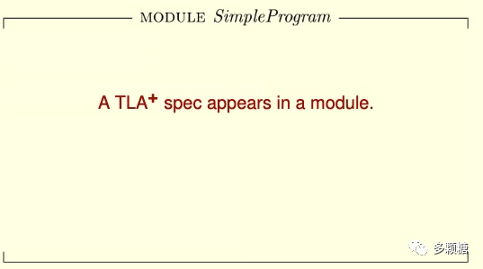

其次，`EXTENDS Integers` 可以理解为 import，就是导入 `Integers` 这个包，用来处理一些整型。

接着，`VARIABLES` 这行即第 0 步，声明 `i` 和 `pc` 是变量；`Init` 这行是 `i` 和 `pc` 的初始值。

最后，`Next` 这行表示状态机的次态关系，只不过这里将我们前面编写的次态关系拆成两个部分，分为 `Pick` 和 `Add1`。

至此，按照前面的状态机抽象步骤，我们的第一个 TLA+ 程序就写完了。下面我们使用 TLA+ Toolbox 验证一下该模型。

## 2、使用 TLA+ 工具箱验证模型

首先你需要前往官网下载 [TLA+ Toolbox](https://tla.msr-inria.inria.fr/tlatoolbox/products/)[^2]，或者[从 Github 进行下载](https://github.com/tlaplus/tlaplus/releases/tag/v1.7.2)[^3]。

打开工具箱，点击 “File -> Open Spec -> Add New Spec…” 创建一个新的 TLA+ 规约，起名为 SimpleProgram.tla，并保存在你想保存的位置。

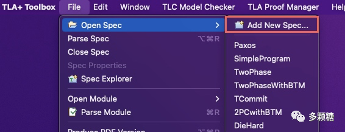

你可以在打开的文件中写入前面学习的规约，或者直接复制。注意，不要超出 MODULE 的范围，否则 IDE 会报错。

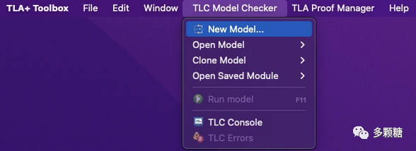

接下来我们点击 “TLC Model Checker -> New Model…” 创建一个新的模型。不出意外的话会弹出一个模型相关的窗口，我们需要手动填入模型的初始值和次态关系，如下图所示：

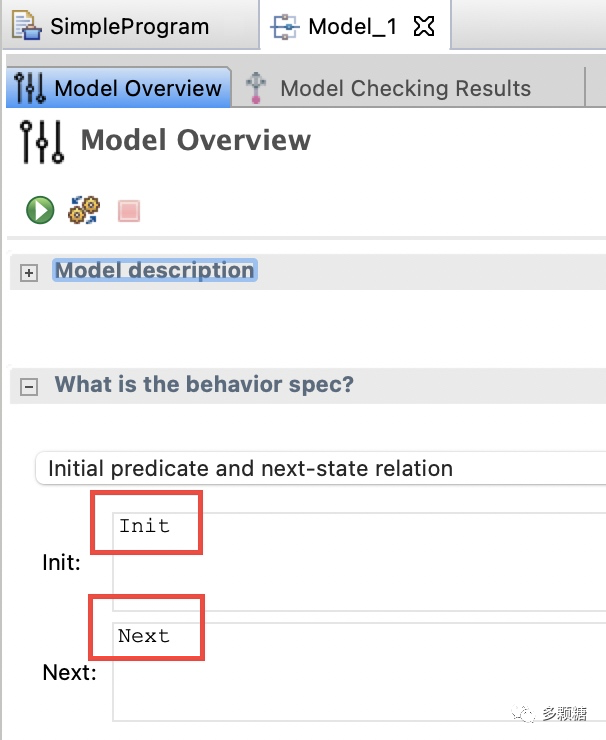

我们点击绿色播放按钮运行模型，你会发现模型报错了。这是因为工具箱默认创建的模型是检查持续运行的系统，而我们的这个模型运行一次就退出了，并不会一直运行下去。仔细观察，在模型视图中有一个 Deadlock 选项被勾上了，我们取消这个选项再运行一次。

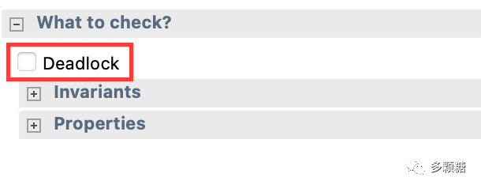

如果你的规约没有问题，应该可以看到模型运行成功。

总结一下，上一节我们介绍过，TLC 检测工具就是遍历所有的状态，然后对其中的可能路径都进行检查，大致原理就是在遍历整个转换图，同时检查我们的不变式是否成立。

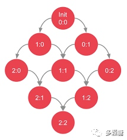

此外，在 tla 文件的页面，点击 “File -> Produce PDF Version”可以生成 PDF 格式的 TLA+ 代码，如下图所示：

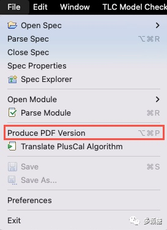

例如，我们的简单程序导出为 PDF 格式后如下：

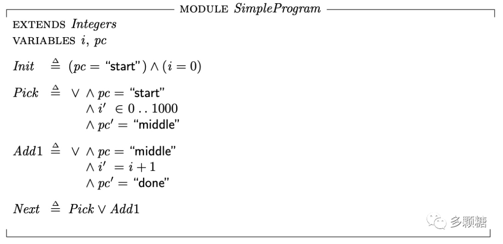

**TLA+ 跟 LaTeX 排版工具一样，有源代码 ASCII 码格式，和渲染后的 PDF 格式**。

## 3、小结

通过这个例子，我们可以发现 TLA+ 语言和编程语言的一些不同，TLA+ 语言包括了：变量、控制流、调用栈甚至堆，后面这些内容通常编程语言都会屏蔽掉。除此之外，TLA+ 语言还需要一些集合论、数理逻辑等数学知识。

TLA+ 难吗？确实有点难，以至于工程师们往往只有在设计很关键、很基础以及难以预测的系统才会去使用它。但 TLA+ 是分布式系统避不开的一环，通过 TLA+ 可以实现：

- 正确设计分布式系统，避免改一个 bug，搞出 10 个 bug；
- 精确理解各种（分布式）算法：Paxos、Raft 都比较复杂，但都给出了 TLA+ 描述，通过学习这些算法的 TLA+ 可以更准确理解算法，验证算法；
- 不只是文档。有了 TLA+，并发和分布式系统可以以更直观、更准确的方式来表达，如果从一开始设计时就是错的，那么剩下的工作都是徒劳。

本节我们浅尝了一下 TLA+ 语言。下一节，我们将使用 TLA+ 来计算电影《虎胆龙威3》中经典的倒水问题。

## 参考资料

[^1]: Lamport 亲自出的教程：http://lamport.azurewebsites.net/video/videos.html

[^2]: 下载 TLA+ Toolbox：https://tla.msr-inria.inria.fr/tlatoolbox/products/

[^3]: 从 Github 下载：https://github.com/tlaplus/tlaplus/releases/tag/v1.7.2
