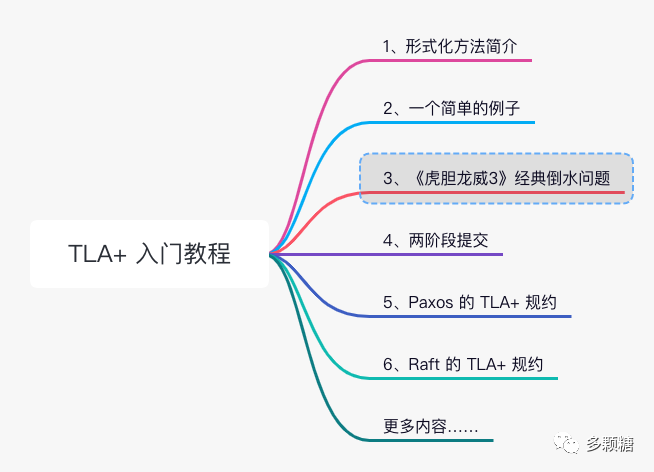
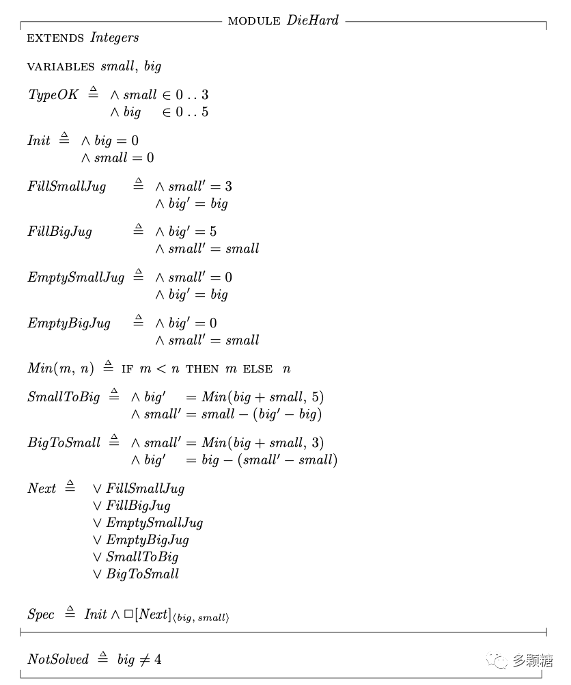
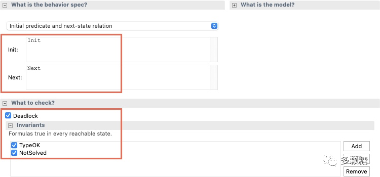
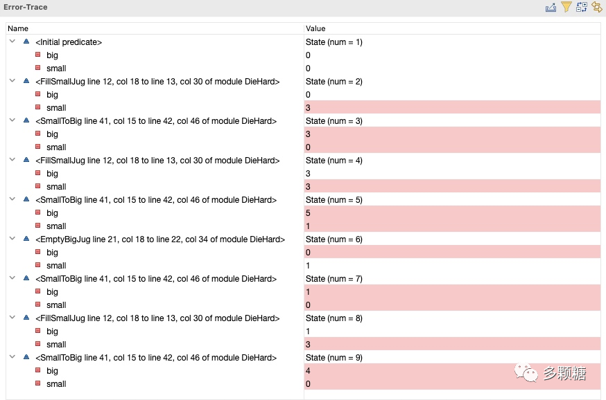

<!-- migrated-from: https://tangwz.com/posts/202207-tla-3/ -->



## 1、倒水问题的 TLA+ 描述

本节我们来看一个更有趣、更具体的例子，布鲁斯·威利斯主要的电影《虎胆龙威3》中有一个经典的倒水问题，电影中主角需要用一个 3 加仑的桶和一个 5 加仑的桶，准确装出 4 加仑的水（说实话第一次听到这个问题应该是脑筋急转弯的题目，还有某些公司的面试题……）。


注意：我们必须**精确得到 4 加仑的水**才能拯救主角，不能用估算的方式，4.1 加仑或 3.9 加仑都会害死我们的主角。

对于这个问题，我们可以通过 TLA+ 进行抽象，并通过 TLA+ 工具箱运行模型来得出问题的解。

本节只有一个 TLA+ 语法知识点，即：TLA+ 函数名在使用前必须要被定义，这一点跟大多数编程语言一样。若不熟悉 TLA+ 基础语法的读者请参考：《TLA+入门教程（2）：一个简单的例子》。

我们还是来定义状态机的三个要素：变量、初始状态和次态关系。

首先变量就两个，一个 3 加仑的桶和一个 5 加仑的桶，定义如下：

```tla+
VARIABLES big,   \* The number of gallons of water in the 5 gallon jug.
          small  \* The number of gallons of water in the 3 gallon jug.

TypeOK == /\ small \in 0..3
          /\ big   \in 0..5
```

`TypeOK` 部分叫做不变式（invariant），可以理解为断言（assert）变量的值必须在这个范围，模型检验工具在运行时会去检查变量是否满足不变式。

第二步是初始值，大小桶的初始值都为零。

```tla+
Init == /\ big = 0
        /\ small = 0
```

最后是次态关系，次态关系可能由一系列动作所产生的，包括：填满小桶（`FillSmallJug`）、填满大桶（`FillBigJug`）、倒掉小桶（`EmptySmallJug`）、倒掉大桶（`EmptyBigJug`）、将小桶的水倒入大桶（`SmallToBig`）、将大桶的水倒入小桶（`BigToSmall`）。

这里我们只需要把这一系列动作枚举出来，不需要去写具体的流程和逻辑（这个工作我们交给模型检验工具）。所以可以得到次态关系：

```tla+
Next ==  \/ FillSmallJug
         \/ FillBigJug
         \/ EmptySmallJug
         \/ EmptyBigJug
         \/ SmallToBig
         \/ BigToSmall
```

当然，我们需要弄清楚每个实际的动作中的变量的变化，举个例子，填满小桶会让 `small' = 3`，而**大桶不变**。

注意：这里非常重要，按照写代码的思维这里也许不需要管大桶变量 `big` 的变化，但是按照 TLA+ 模型，每个变量的状态变化都要反映出来。

于是，我们如下定义次态关系中的动作：

```tla+
FillSmallJug  == /\ small' = 3
                 /\ big' = big

FillBigJug    == /\ big' = 5
                 /\ small' = small

EmptySmallJug == /\ small' = 0
                 /\ big' = big

EmptyBigJug   == /\ big' = 0
                 /\ small' = small

Min(m,n) == IF m < n THEN m ELSE n

SmallToBig == /\ big'   = Min(big + small, 5)
              /\ small' = small - (big' - big)

BigToSmall == /\ small' = Min(big + small, 3)
              /\ big'   = big - (small' - small)
```

注意 `SmallToBig` 和 `BigToSmall` 需要考虑当前大小桶的容量，来决定可以倒入的水量。从小桶倒入大桶时，大桶最多到 5 加仑就不能再倒了；从大桶倒入小桶时，小桶最多到 3 加仑也不能再倒了。

最后，当我们抽象完系统的变量和状态转移后，TLA+ 中把一个系统表达为一个形如 `Spec == Init /\ [][Next]_vars^L` 的时序公式，来描述这个系统的规约（可以看做一个固定的格式）。其中 Init 是初始状态，Next 定义了系统的次态关系，`[]` 表示“总是”的时序操作符，`vars` 指系统中的所有变量构成的元组，L 表示系统的公平(fairness)性。这里我们暂且不管 `[]` 和 `L`，这并不影响我们理解模型。

```tla+
Spec == Init /\ [][Next]_<<big, small>>
```

到现在为止，我们还没有确保整个模型可以得到 4 加仑的水。因此，我们还要额外加入一个限制，即：

```tla+
NotSolved == big # 4
```

显然，我们要得到的 4 加仑的水肯定装在 5 加仑的大桶中，所以我们定义 `big` 不等于 4 这一不变式，意思是，只要出现了 `big` 等于 4 的情况，模型检验工具就会报错而退出。如果运行模型检验工具一直不会退出，那就说明我们抽象的模型有问题。



完整的代码参见：https://github.com/tlaplus/Examples/blob/master/specifications/DieHard/DieHard.tla

下一步，我们来运行模型。

## 2、使用 TLA+ 工具箱运行模型

我们先新建一个名为 DieHard.tla 的规约，然后将上述地址的完整代码复制进去，接着新建一个模型，在 Model Overview 中进行如下配置。



现在，让我们拯救主角！点击绿色运行按钮，等一段时间后，如果 TLA+ 代码没问题，检验程序会退出，并在 Error-Trace 一栏显示类似下图的信息。



观察最后一行，big = 4，与条件冲突，整个检验结束。同时我们也得到了整个状态转换流程，即怎么装水、倒水才能准确得到 4 加仑的水。

试着运行你的模型，看看能否得出其他不一样的解。

下一节，我们将学习在**婚姻和数据库中经常使用的经典分布式算法的 TLA 规约**。

> 公平性 L 是系统活性（Liveness）的基础，如果 Server 为某个进程一直提供服务，剩下的进程都会陷入无限等待，这对该进程之外的进程来说就是不公平的。 公平性根据强弱程度分为强公平性(strong fairness)和弱公平性(weak fairness)。具体来说，强公平性要求系统在 enable 时动作能够无限次执行（not enable 时无要求）；弱公平性不管之前如何，系统从某个时间点开始持续 enable，那么动作能够无限次执行。

参见：[Fairness and Liveness](https://www.ccs.neu.edu/home/wahl/Publications/fairness.pdf)：https://www.ccs.neu.edu/home/wahl/Publications/fairness.pdf
