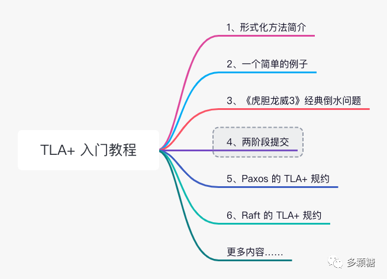
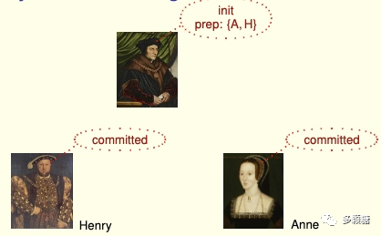
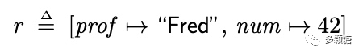
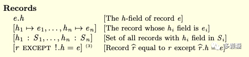
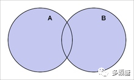
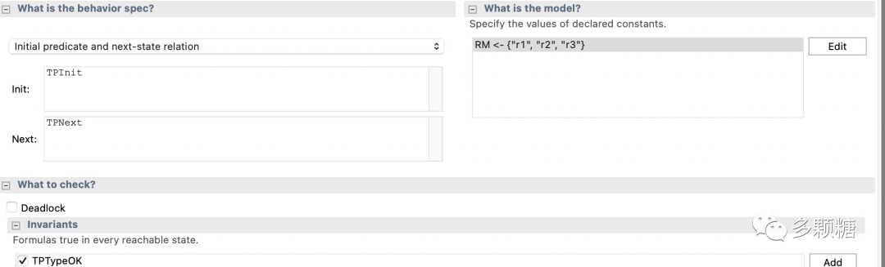

<!-- migrated-from: https://tangwz.com/posts/202207-tla-4/ -->



## 1、两阶段提交

本章要学习的是用在**婚姻**和**数据库领域**的分布式算法——两阶段提交。

据 Lamport 回忆，数据库领域图灵奖得主 Jim Gray 喜欢用婚礼来描述事务，婚礼上除了新娘和新郎，还会有牧师或者司仪，

我们假设新娘 Anne，新郎 Henry 以及牧师 Thomas。婚礼上，牧师先问新郎：“你愿意娶 Anne 为妻吗？”

新郎 Henry：“我愿意。”

牧师再问新娘：“你愿意嫁给 Henry 吗？”

新娘 Anne：“我愿意。”

然后，牧师就会在亲朋好友面前宣布这段关系。

假如新郎或新娘其中一人说不愿意，牧师就会取消婚礼（虽然这很少见，逃。。。）



这个对比很形象地展示了两阶段提交的核心，需要有一个协调者，向多个参与者询问是否可以提交本次事务；只有当多个参与者都确认提交，本次事务才会真正提交；只要有一个参与者表示无法提交，那么协调者就要中止本次事务。

如今，大量分布式系统使用着两阶段提交，该算法简单清晰，容易建模。本节我们将学习两阶段提交的 TLA+ 规约，并认识到分布式系统一些重要且基本的特性。

首先，我们将协调者称作事务管理者（Transaction Manager，TM），参与者称为资源管理者（Resource Managers，RMs），所有的参与者必须就事务提交还是中止达成共识。

_通常来说 RM 可以查询 TM 的状态以更新自己的状态，但是 RM 无法查询其他 RM 的状态。TM 可以读取所有 RM 的状态以更新自己的状态。_

## 2、用到的 TLA+ 操作符

本次会用到一个新的 TLA+ 类型：记录（Records），类似于大多数编程语言中的结构体，例如：



有两个域（成员）`prof` 和 `num`，其中 `r.prof = "Fred"` 和 `r.num = 42`。

ASCII 的语法这样写：

```
r = [prof |-> "Fred", num |-> 42]
```

在 TLA+ 中，`f.prof` 等同于 `f["prof"]`。并且，我们还可以将“f 中除了 prof 以外的都等于 Red”语句写为： `[f EXCEPT !["prof"] = "Red"]` 或者 `[f EXCEPT !."prof" = "Red"]`。

记录的语法主要分为以下四类：



## 3、两阶段提交的 TLA+ 规约

完整代码见：https://github.com/tlaplus/Examples/blob/master/specifications/transaction\_commit/TwoPhase.tla

### 3.1、常量

两阶段提交的 TLA+ 规约只有 1 个常量 `RM`，表示所有资源管理器的集合，如，{r1，r2，r3}。

```tla+
CONSTANT RM \* The set of resource managers
```

**注意：TLA+ 的每个变量或常量都是一个集合，而不只是一个值。**

### 3.2、变量

```tla+
VARIABLES
  rmState,       \* $rmState[rm]$ is the state of resource manager RM.
  tmState,       \* The state of the transaction manager.
  tmPrepared,    \* The set of RMs from which the TM has received $"Prepared"$
  msgs           \* messages.
```

两阶段提交的 TLA+ 规约包括 4 个变量

- `rmState`：用 `rmState[rm]` 表示 rm 的状态，有 4 种可能的状态：“working”, “prepared”, “committed”, “aborted”；
- `tmState`：TM 的状态，有 3 种可能的状态：“init”, “committed”, “aborted”；
- `tmPrepared`：TM 已收到 `Prepared` 消息的 RM 的集合；
- `msgs`：描述正在传输的消息。

```tla+
Message ==
  [type : {"Prepared"}, rm : RM]  \cup  [type : {"Commit", "Abort"}]

TPTypeOK ==
  /\ rmState \in [RM -> {"working", "prepared", "committed", "aborted"}]
  /\ tmState \in {"init", "committed", "aborted"}
  /\ tmPrepared \subseteq RM
  /\ msgs \subseteq Message
```

`TPTypeOK` 是规约的不变式，用来检查变量必须满足的条件。其中 `\subseteq` 代表子集，例如 msgs 一定是 Message 的子集。

此外，`Message` 有一个 `\cup` 操作符，即 `Message` 属于两个集合的并集（写作 `\cup` 或 `\union` 都可以）。例如 `Message = A \cup B`，那么 Message 是 A 中的元素或 B 中的元素，或者两者都有的元素。如下图所示。



进一步来看，`[type : {"Prepared"}, rm : RM]` 这一部分代表，RM 发送到 TM 的 Prepared 消息。`[type : {"Commit", "Abort"}]` 代表 TM 向所有 RM 发送的 Commit 或 Abort 消息。

系统的初始状态如下：

```tla+
TPInit ==
  /\ rmState = [rm \in RM |-> "working"]
  /\ tmState = "init"
  /\ tmPrepared = {}
  /\ msgs = {}
```

`rmState` 中的每个 RM 的状态都为 working，`tmState = "init"` 和 `tmPrepared = {}` 代表 TM 刚初始化的状态，并没有收到任何消息，即 `msg` 为空 `msg = {}`。

### 3.3、动作

两阶段提交的规约定义了 7 种动作，分别对应 TM 的 3 个动作和 RM 的 4 个动作。

```tla+
TMRcvPrepared(rm) ==
  /\ tmState = "init"
  /\ [type |-> "Prepared", rm |-> rm] \in msgs
  /\ tmPrepared' = tmPrepared \cup {rm}
  /\ UNCHANGED <<rmState, tmState, msgs>>
```

只有当 TM 为 `init` 状态，并且收到来自 RM 的 Prepared 消息之后，`tmPrepared` 会被更新为 `tmPrepared` 和发送消息的 RM 的并集，换句话说，发送消息的 RM 会被添加到集合 `tmPrepared` 中。这里如果 RM 已经在 `tmPrepared` 中，那么 `tmPrepared'` 将会不变。

最后一行 `UNCHANGED` 表示其他状态都不变。

```tla+
TMCommit ==
  /\ tmState = "init"
  /\ tmPrepared = RM
  /\ tmState' = "committed"
  /\ msgs' = msgs \cup {[type |-> "Commit"]}
  /\ UNCHANGED <<rmState, tmPrepared>>
```

只有当 TM 为 init 状态并且 tmPrepared = RM 时，即初始状态的 TM 收到来自所有 RM 的 Prepared 消息，TM 会进入提交阶段。

```tla+
TMAbort ==
  /\ tmState = "init"
  /\ tmState' = "aborted"
  /\ msgs' = msgs \cup {[type |-> "Abort"]}
  /\ UNCHANGED <<rmState, tmPrepared>>
```

只有当 TM 为 init 状态并且收到来自一个 RM 的 Abort 消息时，该动作才会启用。

```tla+
RMPrepare(rm) ==
  /\ rmState[rm] = "working"
  /\ rmState' = [rmState EXCEPT ![rm] = "prepared"]
  /\ msgs' = msgs \cup {[type |-> "Prepared", rm |-> rm]}
  /\ UNCHANGED <<tmState, tmPrepared>>
```

只有当 `rmState[rm] = "working"` 时，RM 表示自己准备好了，RM 更新自己状态为 prepared，并且向 TM 发送 Prepared 消息。

```tla+
RMChooseToAbort(rm) ==
  /\ rmState[rm] = "working"
  /\ rmState' = [rmState EXCEPT ![rm] = "aborted"]
  /\ UNCHANGED <<tmState, tmPrepared, msgs>>
```

当 `rmState[rm] = "working"` 时，也可能会中止事务。只要有一个 RM 中止事务，整个事务都必须中止，即 TM 最终会调用 `TMAbort`。在实际系统中，RM 会告诉 TM 它已经中止事务，因此 RM 会知道它应该中止事务，但这种优化可以省略。

```tla+
RMRcvCommitMsg(rm) ==
  /\ [type |-> "Commit"] \in msgs
  /\ rmState' = [rmState EXCEPT ![rm] = "committed"]
  /\ UNCHANGED <<tmState, tmPrepared, msgs>>

RMRcvAbortMsg(rm) ==
  /\ [type |-> "Abort"] \in msgs
  /\ rmState' = [rmState EXCEPT ![rm] = "aborted"]
  /\ UNCHANGED <<tmState, tmPrepared, msgs>>
```

当 RM 收到 commit 或 abort 消息，他会更新自己到对应的状态。

这里有一个细节读者可以思考下，根据 TLA+，RM 只有在状态为 working 的时候才能中止，为什么 RM 处于 prepared 状态的时候不能中止呢？

> RM 发送 prepared 消息后才进入 prepared 状态，换句话说，prepared 状态意味着准备好提交了，如果此时还允许 RM 进入 abort 状态，TM 仍可能会发送 Commit 事务消息——尽管一些 RM 并不同意提交，但这与规约相矛盾。

### 3.4、行为

`TPNext` 定义了次态关系，`Spec` 定义了完整的行为规约。

```tla+
TPNext ==
  \/ TMCommit \/ TMAbort
  \/ \E rm \in RM :
       TMRcvPrepared(rm) \/ RMPrepare(rm) \/ RMChooseToAbort(rm)
         \/ RMRcvCommitMsg(rm) \/ RMRcvAbortMsg(rm)
-----------------------------------------------------------------------------
TPSpec == TPInit /\ [][TPNext]_<<rmState, tmState, tmPrepared, msgs>>
```

TPNext 是所有七个子动作的析取，其中第 3 行以下的语法等同于：

```tla+
\/ \E rm \in RM: TMRcvPrepared(rm)
\/ \E rm \in RM: RMPrepare(rm)
          .
          .
          .
\/ \E rm \in RM: RMRcvAbortMsg(rm)
```

TPSpec 这是按照之前说过的固定的格式写的。

## 4、运行模型检验工具箱

按照下图设置运行模型必要的变量和不变式，然后运行模型，应该会得到正确的结果；否则，你应该仔细检查你的 TLA+ 规约。



另外，除了 `TPTypeOK` 不变式，我们还可以检查模型的一致性，即两个不同 RM 不会一个选择提交一个选择中止，`TPConsistent` 不变式如下：

```tla+
TPConsistent ==
  \A rm1, rm2 \in RM : ~ /\ rmState[rm1] = "aborted"
                         /\ rmState[rm2] = "committed"
```

将 `TPConsistent` 加入你的规约，并且添加到模型检验工具，运行试试吧！

## 5、深入两阶段提交

到此为止，我们没有去讨论两阶段提交发生故障时的行为，这方面内容网上也有很多博客进行更进一步地讨论，例如：TM 挂了会怎样，RM 挂了一个会怎样？其实这些内容都可以通过 TLA+ 进行模拟

亚马逊的高级研究员 MURAT 就写了一篇使用 TLA+ 验证和探讨两阶段提交各种问题的博客：http://muratbuffalo.blogspot.com/2018/12/2-phase-commit-and-beyond.html

MURAT 在文中修改了 Lamport 的两阶段提交代码，以支持模拟 TM 故障和 RM 故障时的算法情况，并且一步步引出 FLP 不可能和 Paxos 协议。感兴趣的读者可以仔细阅读博客，并且复制他的 TLA+ 代码来自己验证一下，这样你能更深入的理解两阶段提交的局限。

Paxos, making the world a better place

下一节，我们就来学习 Paxos 协议的 TLA+ 规约。
