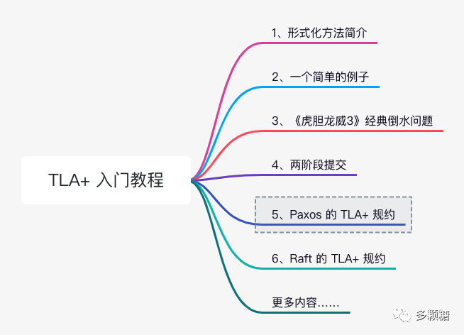
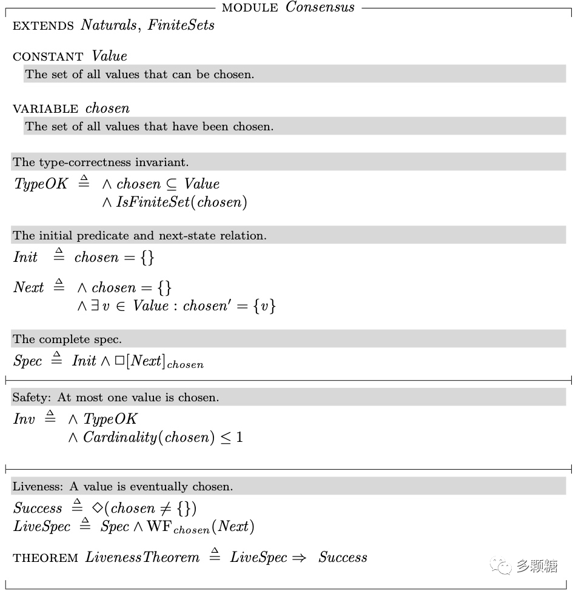
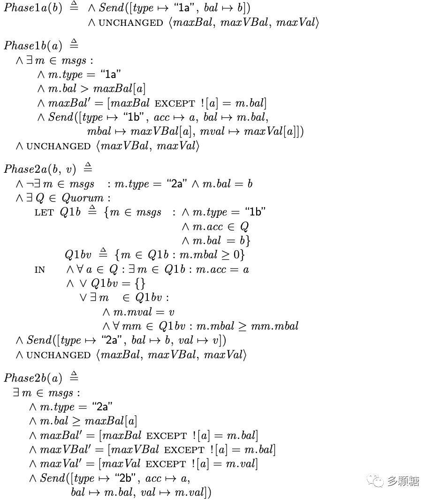
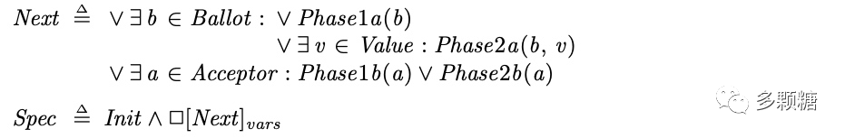
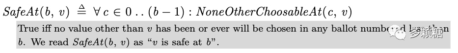

<!-- migrated-from: https://tangwz.com/posts/202208-tla-5/ -->

## 1、Paxos 简介

上一节我们讨论了两阶段提交的 TLA+ 规约。众所周知，两阶段提交有一个明显的缺点，如果 TM 宕机，整个流程将停滞不前。

有一个简单的工程解决办法：准备一个备 TM 节点，如果主 TM 故障，备 TM 节点将接替主 TM 的工作。这是在很多教材上都有写的解决方案，这个方案大多数时候都运行得很好，直到有一天：

- 主 TM 决定 commit，但是紧接着就卡住或宕机了；
- 备 TM 认为主已经宕机，决定接管任务；
- 备 TM 广播 Abort 消息；
- 但此时，主 TM 恢复并广播 Commit 消息；
- 这会出现部分 RM 提交事务而部分 RM 中止事务，导致系统问题；

可见引入备 TM 仍然有瑕疵。寻找容错的分布式算法十分困难，**很容易出现一些在测试阶段无法发现的问题**。因此，在编码之前，我们必须先确定算法正确！

Lamport 说过：”**编写和检查 TLA+ 规约是我目前知道如何做到这一点的最佳方式**(We should get the algorithm right before we code.Writing and checking a TLA+ spec is the best way I know to do that.)

可见，一个分布式算法的正确性需要经过必要的数学论证和形式化工具的检验。

那么，我们如何才能保证多个 TM 节点就某个节点是主 TM 达成共识呢？更进一步，我们如何让分布式系统中的多个节点就某个值达成共识？经常阅读我的博客的读者应该知道，Paxos 就是解决这个问题的经典协议。

本节需要读者了解 Paxos 协议的基本流程，如果你还不具备这部分预备知识，建议阅读我之前写的：《理解 Paxos（含伪代码）》，或购买我的书籍《深入理解分布式系统》。

## 2、分布式共识

分布式共识问题亦可以用 TLA+ 来描述，源代码参见：https://github.com/tlaplus/Examples/blob/master/specifications/Paxos/Consensus.tla

其中，常量 `Value` 表示所有可能的提案值的集合，提议的值由 Proposer 提出；变量 `chosen` 表示已被选定的值的集合。

初始状态下 `chosen` 为空。下一个状态为：如果 chosen 为空，则从 `Value` 中任选一个值 v 加入 chosen 中(即选定 v)。

不变式主要分为安全性和活性，安全性的不变式 `Inv`，要求 chosen 中的元素个数不超过 1，即安全性要求最多只有一个值被选定。

活性的不变式分为 `Success` 和 `LiveSpec`，要求最终会有某个值被选定。

> 注意：`LiveSpec == Spec /\ WF_chosen(Next)` ，这里有个特别的语法，变量 `chosen` 前面有个 `WF_`，WF指弱公平性(weak fairness) 。WF_vars(A) 刻画了动作 A 的公平性，即要求: 如果动作 A 从某个时刻开始是持续可执行的,则 A 最终将被执行。

简单来说，共识的核心问题就是分布式系统选定一个值，并且满足安全性和活性。

## 3、Paxos 协议的 TLA+ 规约

Paxos 协议的 TLA+ 规约来自：https://github.com/tlaplus/Examples/blob/master/specifications/Paxos/Paxos.tla

篇幅原因，这里不再介绍 Paxos 协议基本流程等预备知识，请参见：《理解 Paxos（含伪代码）》。

实际上，如果你不知道 Paxos 协议的流程，通过学习本文 TLA+ 规约，应该会使你更深入理解该协议细节。

### 3.1、常量

Paxos 协议的 TLA+ 规约有 3 个常量：

- `Value`：所有可能的提案值的集合，例如 {v1, v2, v3}，且有 `None == CHOOSE v : v \notin Value` 表示不属于 `Value` 的某个特殊值；
- `Acceptor`：所有接受者的集合；
- `Quorum`：由接受者组成的多数派集合，`QuorumAssumption` 表示多数需要满足的条件。

提案编号用 Ballot 表示，且 `Ballot == Nat`，即 Ballot 是一个自然数。

消息共有四种，对应 Paxos 算法的四个阶段： Phase1a、Phase1b、Phase2a 和 Phase2b。通过 Phase1b 的消息可以看到，用 -1 表示 Ballot 初始化时的最小提议编号。

### 3.2、变量

变量有 4 个：

- `maxBal`：`maxBal[a]` 表示接受者 a 见到过的最大提议编号，是 a 承诺可以接受的提议的最小编号；
- `maxVBal`：`maxVBal[a]` 表示接受者 a 接受过提议的最大编号；
- `maxVal`：对应 `maxVBal[a]` 的提案值；
- `msgs`：所有已发送消息的集合。参与者通过向该集合添加消息，或者从该集合读取消息模拟消息的发送(广播)与接收动作。Send(m) 将消息 m 加入到 msgs 中。如前所述，共有四种消息。

`TypeOK` 定义了各个变量的类型，`Init` 给出了各个变量的初始状态。

### 3.3、动作

Paxos 的 4 个动作对应协议的四个阶段。

- Phase1a(b)：Proposer 选取提议编号 b 并发送 Phase1a 消息，消息类型为 “1a”；
- Phase1b(a)：一旦 Acceptor 收到类型为 “1a” 的消息 m，如果 m 中的提案编号 `m.bal` 如果大于 `maxBal[a]`，则将 Acceptor 的 `maxBal[a]` 更新为 `m.bal`，并将接受过的最大的提案编号 `maxVBal[a]` 和提案的值 `maxVal[a]` 回复给 Proposer，消息类型是 “1b”；
- Phase2a(b, v)：Proposer 对提案 <b, v> 发起 Phase2b 消息。但是有两个前提，（1）第一句式子，要求 msgs 中没有提案编号为 b 的 “2a” 类型消息，即 Proposer 没有执行过 Phase2a(b, v)；（2）第二个较长的式子要求，存在多数派 Q，Q 中的每个 Acceptor 都回复过提案编号为 b 的 Phase1b 消息，即我们常说的，获得多数派 Acceptor 的回复。这两个条件都成立时，Proposer 发送 “2a” 消息。
- Phase2b(a)：Acceptor 收到 “2a” 消息 m 时进行判断，当且仅当 `m.bal >= maxBal[a]`，Acceptor 才会接受提案 <b, v>，同时更新自己的变量 `maxBal`、`maxVBal[a]` 和 `maxVal[a]` 的状态，然后回复 “2b” 消息。

可见，Paxos 的 TLA+ 规约已经把整个协议的流程说得很明白了！同时修复了论文中 Phase2b 中并没有提到的，需要 Acceptor 更新 `maxBal[a]`。

有读者曾在交流群里提出疑惑，**Phase1b 阶段的 Acceptor 判断 Ballot 是大于还是大于等于**，通过 TLA+ 消息，你能想明白吗？

### 3.4、行为

`Next` 定义了下一个状态，`Spec` 定义了完整的行为规约。

## 4、深入 Paxos 协议

为了更好理解 Paxos 协议，Lamport 给出了另一个更抽象的规约，参见：https://github.com/tlaplus/Examples/blob/master/specifications/PaxosHowToWinATuringAward/Voting.tla

根据 `Voting` 规约的信息，我们知道：Paxos 协议的核心在于 Acceptor 接受什么样的提案，第一阶段，Acceptor 只接受提案编号比它回复过的最大提案编号 `maxBal[a]` 还要大的提案；第二阶段，可被接受的提案 `<b, v>` 需要满足两个关键的条件：

- `OneValuePerBallot`，即，每个提案编号最多对应一个提案值，也隐含了一个 Acceptor 只能选定一个提案；

- `SafeAt(b,v)`，提案 <b, v> 是安全的，指对于任何提案编号小于 b 的提案，除了 v 以外没有其他的值被选定过，将来也不会有其他值被选定。

Lamport 使用 TLAPS(TLA+ proof system) 证明了 Paxos 协议正确性的关键在于上述两个条件，即只要满足这两个条件，就能保证 Paxos 的正确性。
