<!-- migrated-from: https://tangwz.com/posts/202208-tla-6/ -->

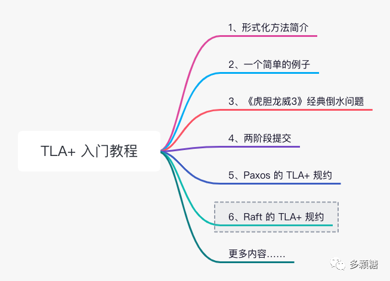

与上一节讨论 Paxos 时一样，本文不介绍 Raft 协议基本知识，读者需已经了解 Raft 协议，如无这部分背景知识，请阅读 Raft 论文或参见《条分缕析Raft算法》。

## 1、Raft 协议的 TLA+ 规约

本文参考 Diego Ongaro 提供的 TLA+ 规约：https://github.com/ongardie/raft.tla

### 1.1、常量

Raft 的 TLA+ 规约将系统抽象为以下几个常量：

*   `Server`，节点 ID 集合
*   `Value`，客户端的一系列请求，发送到 Raft 状态机的值
*   `Follower, Candidate, Leader`，Raft 节点的三个状态
*   `Nil`，空的消息
*   四种消息类型 `RequestVoteRequest`, `RequestVoteResponse`, `AppendEntriesRequest`, `AppendEntriesResponse`

### 1.2、变量

Raft 的 TLA+ 规约包括的变量主要还是和论文 Figure 2 相对应。

所有节点都有：

*   `currentTerm`，当前任期，需要持久化；
*   `votedFor`，投票信息，需要持久化；
*   `log`，日志，需要持久化；
*   `state`，节点状态，三种 `Follower, Candidate, Leader`；

Candidate 变量：

*   `votesResponded`，候选者在当前任期收到的 `RequestVote` 响应；
*   `votesGranted`，候选者收到来自 `RequestVote` 的投票；

Leader 变量：

*   `nextIndex`，发送给 Follower 的下一个日志；
*   `matchIndex`，领导者用来统计计算 `commitIndex`。如果超过半数节点的 `matchIndex >= N` 且任期一致，那么可以更新 `commitIndex = N`。

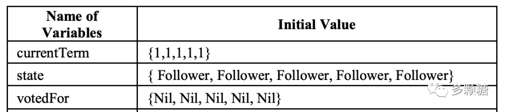

### 1.3、动作

Raft 的动作较多，我们重点看节点是如何处理 `RequestVote` 和 `AppendEntries` 的。

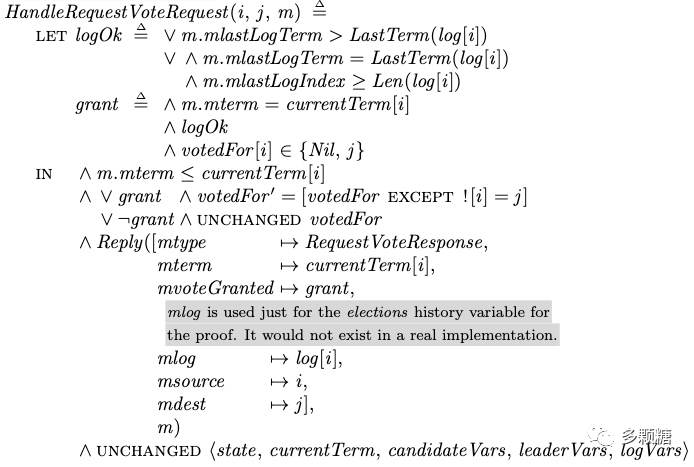

领导者选举的关键就是判断 `logOk` 和 `grant`。`logOk` 需要找出日志最新并且最完整的节点，最新就是任期最大，最完整就是日志最长。`grant` 就是在 `logOk` 正确的情况下，需要任期相同，并且没投过票或投票给请求节点。

之后，候选者收集请求响应，判断是否收到超过半数的选票，来决定是否成为领导者。

`HandleAppendEntriesRequest` 比较长，我们一步步来看。

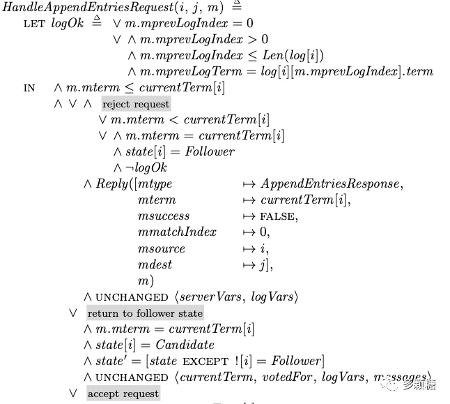

首先，根据 `Receive(m)`，如果消息体中的任期大于当前节点的任期，会先调用 `UpdateTerm(i, j, m)` 更新一些变量。之后，消息体中的任期小于等于当前节点的任期的情况。

这里的 `logOk` 与 `RequestVote` 的检查不同，主要进行日志的一致性检查，`AppendEntries` 请求会包含新日志之前一条日志的索引(记为 `prevLogIndex`)和任期(记为 `prevLogTerm`)；跟随者收到请求后，会检查自己最后一条日志的索引和任期号是否与 `prevLogIndex` 和 `prevLogTerm` 相匹配，匹配则接收该记录；否则拒绝。

该流程被称为一致性检查，如下图所示。

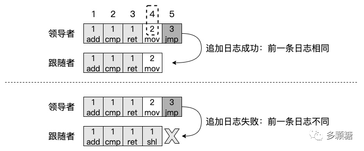

一致性检查的原理可以用数学归纳法来证明，就是：首先，初始状态日志都是空的。其次，每追加一条日志都要通过一次性检查保证前一条日志是相同的。最后可得，这条日志之前的所有日志都是相同的，能够满足上述的日志安全性。

接下来的代码比较长，主要分为：

*   **情况 1**，领导者任期更小，或者任期相同但日志一致性检查不通过，拒绝这次请求。

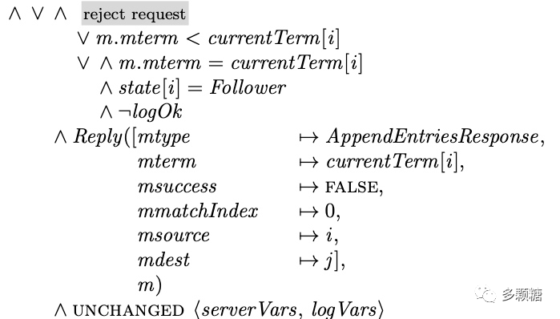

*   **情况 2**，任期相同，但当前节点是 Candidate 状态，转为 Follower。

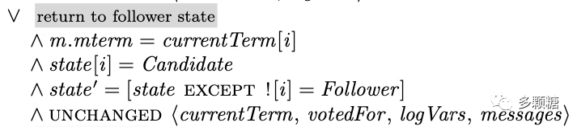

*   **情况 3**，前面的条件都满足，接受请求。

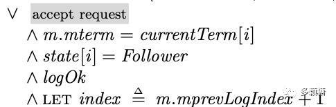

但是，情况三根据节点日志不同，又分为多种情况。

*   **情况 3.1**，如果消息体中日志信息为空（即为心跳信息），或者该日志已经存在节点日志中，可能会导致 `commitIndex` 发生变化。

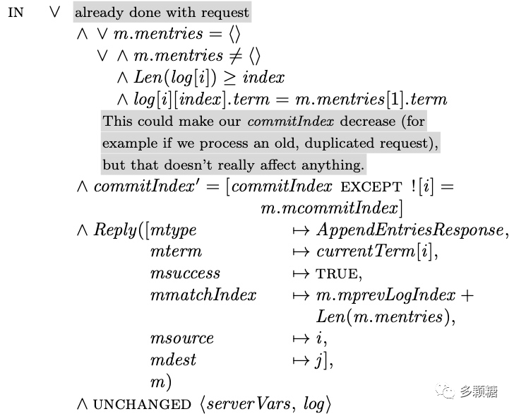

*   **情况 3.2**，如果日志冲突，将会以领导者的日志为准，删除节点的日志。

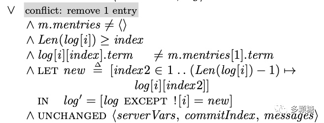

*   **情况 3.3**，如果没有冲突刚刚好，直接插入日志即可。

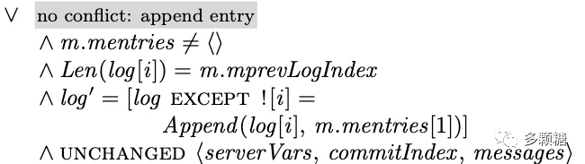

分析到这里，笔者觉得按照 Raft 算法的 TLA+ 去完成 6.824 的实验应该更清晰更简单。

其他动作还有很多，但并没有这两处重要，究其根本这些动作主要还是围绕着服务器的三种状态来运行，我们可以通过 Follower、Leader、Candidate 之间的转换关系来梳理这些动作，篇幅所限，这里就不一一详述这些步骤的作用了，参见下图：

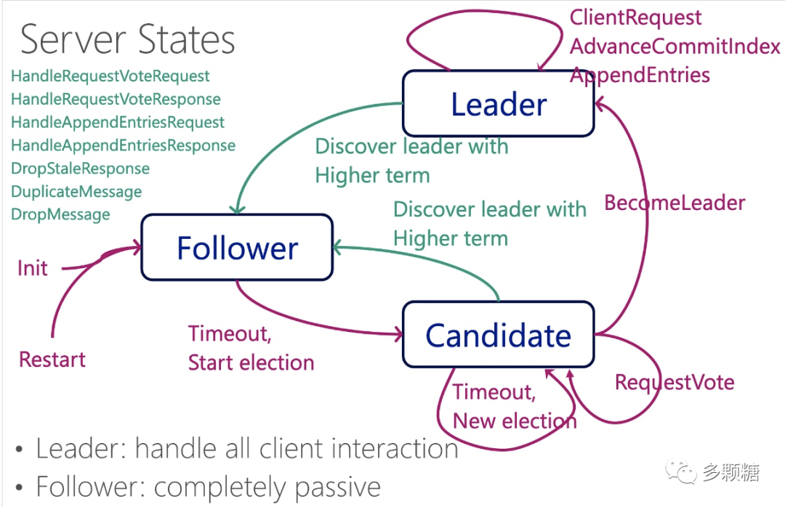

## 2、运行 TLA+ model checker

需要指出的是，Diego ongaro 的 raft.tla 仓库代码无法使用 TLA+ model checker 运行，而且作者本人也不打算继续维护。

不过，Jin Lin fork 了代码，并且进行了补充，给出了一个能够通过 TLA+ model checker 运行的 tla+ 代码。地址是：[https://github.com/jinlmsft/raft.tla](https://github.com/jinlmsft/raft.tla)

如果不知道变量怎么设置，建议直接 clone 仓库，然后通过 TLA+ model checker 直接打开然后运行。我亲测是可以运行的。

Jin Lin 针对 Raft 的 TLA+ model checker 也有一个很好的 Talk。

## 完结撒花

Raft 的 TLA+ 跟伪代码十分接近，是学习该算法非常好的资料，感兴趣的同学可以用模型验证器跑一跑 Jin Lin 的代码。

到这里我们的 TLA+ 教程就完结了，虽然这个系列阅读数据一般，但我觉得学习分布式系统还是需要掌握一些 TLA+ 知识，并不是说一定要会写，至少看得懂，知道怎么回事，能看懂一些经典算法的 TLA+ 程序，辅助自己实际编码。

以后可能还会分享一些 TLA+ 相关的知识，这个系列教程先告一段落了。
